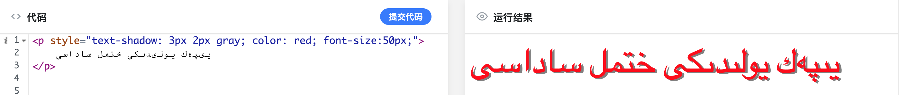
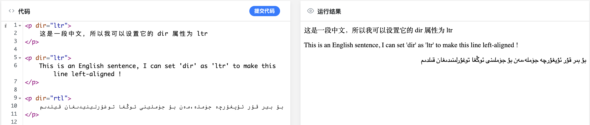

# يىپەك يولىدىكى HTML ساداسى | 3-قىسىم

## HTML دىكى خاسلىقلارنىڭ تۈرى

ئالدىنقى قىسىمدا بىز HTML دىكى خاسلىقلار ئېلېمېنتلارنىڭ  بەت يۈزىدە ئوخشىمىغان ئۇسلۇبتا نامايەن بولۇشىنى بەلگىلەيدىغانلىقىنى، شۇنداقلا، خاسلىقلارنىڭ خاسلىق نامى ۋە قىممىتىنى ئۆز ئىچىگە ئالىدىغانلىقىنى تەكىتلەپ، ئۇلارنىڭ `نامى = "قىممىتى"`  دىگەن شەكىلدە ئىشلىتىلىدىغانلىقىنى تىلغا ئىلىپ ئۆتۈپ كەتكەن ئىدۇق،

 بۇ بابتا HTML نىڭ بەلگىسى ئىچىدىكى خاسلىقنى كونترول قىلىش ئۇسۇلى ۋە بىر نەچچە خىل ئورتاق قوللىنىلىدىغان خاسلىقنى قىسقىچە تونۇشتۇرىمىز. خاسلىق HTML خەتكۈچلىرى ئىچىدە تەمىنلىگەن قوشۇمچە ئۇچۇر بولۇپ، ئادەتتە مەلۇم ئىلىمىنتنى تەسۋىرلەش ياكى ئۇنىڭ ئىپادىلىنىش شەكلىنى كونترول قىلىشتا ئىشلىتىلىدۇ.


### 1. ئورتاق خاسلىقلار

كۆپىنچە خەتكۈچلەرگە ئورتاق ئىشلىتىشكە بولىدىغان خۇسۇسىيەتلەرنى بىز «ئورتاق خاسلىق» دەپ ئاتايمىز. تۆۋەندە بىز دائىم ئۇچرىتىپ تۇرىدىغان بىر نەچچە خىل ئورتاق خاسلىق بىلەن تونۇشۇپ چىقايلى.

* `accesskey` خاسلىقى

بۇ خاسلىق بولسا بىر ئىلىمىنتقا فوكۇسلىنىش تىز كونۇپكىنى بىكىتىشكە ئىشلىتىلىدۇ. 

```html
<!-- men bir qur izah, "Alt + H" konupkisini bassigiz, töwendiki katek fokuslinidu  -->
<input type="text" accesskey='H'/>

<a href='http://www.baidu.com' accesskey="W"> "Alt + H" ni bassigiz, men fokuxlinimen </a>

<button accesskey="B"> "Alt + B" ni bassigiz, men fokuslinimen </button>

```

يۇقارقى كودنىڭ ئىچىگە يىزىلغان لاتىنچە چۈشەندۈرشتە ئېيتىلغىنىدەك، سىز `Alt + X` كونۇپكىسىنى بىسىش ئارقىلىق مۇناسىۋەتلىك ئىلىمىنتلارنى فوكۇسلىيالايسىز. ھازىرغا قەدەر `<a> <area> <button> <input> <label> <legend>  `  قاتارلىق ئىلىمىنتلار بۇ خاسلىقنى قوللايدۇ. شۇنى ئەسكەرتىپ قويغۇم كىلىدۇكى، بىر ئىلىمىنتنى فوكۇسلىۋالغاندىن كىيىن، سىز كونۇپكا تاختىسى ئارقىلىقلا تېخىمۇ ئىچكىرىلىگەن مەشغۇلاتلارنى قىلالايسىز، مەسىلەن تور بەت يۈزىدىكى كونۇپكىنى فوكۇسلاپ `Enter` نى باسسىڭىز، مائۇسنى سۆرەپ ئاپىرىپ شۇ كونۇپكىنى چەككەن بىلەن ئوخشاش نەتىجىگە ئىرىشەلەيسىز.


* `class` خاسلىقى

بۇ خاسلىق ئىلىمىنتلارنىڭ class نامى (ياكى تىپ نامى) نى بەلگىلەپ بىرىدۇ. تىپ نامى چوقۇم لاتىنچە ھەرپتىن باشلىنىشى كىرەك شۇنداقلا چوڭ-كىچىك لاتىن ھەرپلىرى ۋە `-`  (ئوتتۇرا سىزىق) ۋە `—`  (ئاستى سىزىق) قاتىرلىق بەلگىلەرنى ئۆز ئىچىگە ئالسا بولىدۇ. تەكىتلەپ قويىدىغىنىم، بىر ئىلىمىنتقا بىردىن كۆپ تىپ نامى بەلگىلەشكە بولىدۇ، پەقەت سىز تىپ ناملىرىنى بوش ئورۇن بىلەن ئايرىۋەتسىڭىزلا بولدى.

```html
<p class="abzas mezmun qizil-xet"> 
	bu bir abzas eliminti, men bu abzasqa vch class nami berdim.
</p>
```

تىپ نامى بەلگىلەش ئۈستىدىكىدەكلا ئاددىي بولۇپ، بىز ئۇلار ئارقىلىق مەلۇم بىر تىپ ئىلىمىنتلارنى تاللاپ، ئۇلارنى مەشغۇلات قىلالايمىز.

> بۇ يەردە بىز كىلەركى مەۋسۇمدىكى مەزمۇنلاردىن ئالدىن شەپە بىرىپ قويمىساق بولمايدىغاندەك تۇرىدۇ. يەنى بىز يۇقارقى ئىلىمىنتقا تىپ بەلگىلىۋالغاندىن كىيىن، جاۋاسىكرىپ ياكى CSS ئارقىلىق شۇ تىپتىكى ئىلىمىنتلارنى تاللاپ، ئۇلارغا تېخىمۇ كۆپلىگەن خاسلىقلار ياكى ئىقتىدارلارنى قاتالايمىز. مەسىلەن تۆۋەندىكى CSS كودى پۈتۈن `abzas` تىپ نامى بىرىلگەن ئىلىمىنتلارنىڭ تەگلىك رەڭگىنى سىرىق رەڭگە ئۆزگەرتىدۇ. 
>
> ```
> .abzas {
> 	background-color: yellow;
> }
> ```
>
> 


* `id` خاسلىقى

بۇ خاسلىق يۇقارقى تىپ نامى بىلەن ئوخشاپ كىتىدىغان بولۇپ، ئوخشىمايدىغان يىرى `id` ھەر بىر بەت يۈزىدىكى يەككە ئىلىمىنتقا نىسپەتەن بىردىنبىر قىلىنىپ بەلگىلىنىشى كىرەك، خۇددى ھەر بىر ئادەمنىڭ كىملىك نۇمۇرى بىردىنبىر بولغانغا ئوخشايدۇ (ھىچ بولمىغاندا نەزىرىيە جەھەتتن شۇنداق بولۇشى كىرەك) . يۇقىرىدا تىلغا ئالغان تىپ نامى ئوخشاش تىپلىق بىر تۈركۈم ئىلىمىنتلارنى تاللاشقا ئىشلىتىلگىنىدەك، بۇ  `id` خاسلىقى ھەر بەت يۈزىدە بىردىنبىر بولۇش سۈپىتى بىلەن، مەلۇم بىر يىگانە ئىلىمىنتنى تاللاش ئۈچۈن ئىشلىتىلىدۇ. 

```html
<div id="sinaq"> siz mushu `sinaq` digen id arqiliq, mini tallap chiqalaysiz  </div>
```


* `lang` خاسلىقى

بۇ خاسلىق تور بېتى ياكى ئېلېمېنتلارنىڭ تىلىغا ئېنىقلىما بېرىدۇ، گەرچە بۇ خاسلىقنىڭ HTML ئىلىمىنتلىرىنىڭ بەت يۈزىدىكى كۆرسىتىلىشىگە ئانچە چوڭ تەسىرى بولمىسىمۇ، لېكىن ئىزدەش موتورى ياكى تور كۆرگۈچنىڭ مەلۇم بىر تور بەتنىڭ تىلىنى پەرقلەندۈرۈشىگە ياردەم بېرىدۇ. 

```html
<!-- pvtvn bir betning tiligha iniqlima berduq. -->
<html lang="en">
	This is an English website
</html>

<!-- yaki, bir bölek mezmungha tilni bikitip bersek bolidu -->
<p lang="ug">
  بۇ بىر ئۇيغۇرچە ئابزاس
</p>

```

> بۇ `lang` خاسلىقىنىڭ قىممەتلىرى `ISO 639-1` تەرىپىدىن بىكىتىلگەن بولۇپ، ھەرخىل تىللارنىڭ قىسقارتىلمىسىنى تۆۋەندىكى ئاددرىستىن ئىزدەپ ئىشلەتسىڭىز بولىدۇ.
> http://www.loc.gov/standards/iso639-2/php/code_list.php  


* `style` خاسلىقى

مانا بۇ خاسلىقنى ئۆگۈنىۋالساق، ئەمدى نەچچە ۋاقىتنىڭزى يىزىپ كىلىۋاتقان «تايىنى يوق» HTML ئىلىمىنتلىرىغا بىر قۇر پەرداز قىلىپ، تويىنى قىلغىدەك چىرايلىق قىلىۋىتەلەيمىز. 😁

بۇ خاسلىقنى بىز «پاسون» دەپ ئالساق بىرئاز چۈشۈنۈشلۈك بولسا كىرەك، يەنى ئىسمىدىن چىقىپ تۇرۇپتىكى، بۇ خاسلىق ئارقىلىق بىز ئىلىمىنتلارنىڭ پاسونىغا ئىنىقلىما بىرەلەيمىز. شۇنداقلا، `` ئارقىلىق ئىنىقلىما بەرگەن پاسون «قۇر ئىچى پاسونى» ياكى «ئىچكى باغلانغان پاسون» دەپمۇ ئاتىلىدىغان بولۇپ، ئىلىمىنقا تەسىر كۆرسىتىش دەرىجىسى ئەڭ يۇقىرى بولىدۇ. 



ئۈستىدە كۆرگىنىمىزدەك، بىز `sytle` خاسلىقى ئارقىلىق ئىلىمىنتلارنىڭ پاسونىنى خالىغانچە ئۆزگەرتەلەيىمىز. پەرداز قىلغان ئىلىمىنتلار ئادەمنىڭ كۆزنىڭ يىغىنى يەيدۇ جۇما !

 

* `dir` خاسلىقى

مانا بۇ خاسلىق بولسا بىزنىڭ يىزىقىمىزدەك ئوڭدىن-سولغا يىزىلىدىغان يىزىقلارنىڭ «قۇتقۇزغۇچىسى» بولمىش، ئىلىمىنتلارنىڭ مەزمۇنىنىڭ يۆنىلىشىنى بەلگۈلىگۈچى خاسلىق. بۇ خاسلىقنىڭ سۈكۈتتىكى تەڭشىكى `ltr` بولۇپ، لاتىن ۋە خەن قاتارلىق يىزىقلارنىڭ بەت يۈزىدە كۆرسىتىلىشىگە ماس كىلىدۇ. بىزنىڭ يىزىقىمىزغا ئوخشاش ئوڭدىن-سولغا يىزىلىدىنغان يىزىقلارنى بەت يۈزىدە ئوڭغا توغرۇلاپ كۆرسىتىش ئۈچۈن، بىز شۇ توغۇرلىماقچى بولغان ئىلىمىنتنىڭ `dir` خاسلىقىغا `rtl` قىممىتىنى بەرسەكلا بولىدۇ.

 


تېخىمۇ كۆپ ئورتاق خاسلىقلارنى بىز داۋەملىق ئىشلىتىش جەريانىدا ئۆگۈنۈپ ماڭساق بولىدۇ. ئەگەر قىزىقىدىغانلار بولسا، تۆۋەندىكى ئۇلانمىنى چىكىپ ئورگان تەرەپ تەمىنلىگەن بارلىق خاسلىقلار بىلەن تونۇشۇپ چىقساڭلار بولىدۇ.

https://developer.mozilla.org/en-US/docs/Web/HTML/Attributes


### 2. HTML5 تە يىڭىدىن قېتىلغان خاسلىقلار


* `contenteditable` خاسلىقى


* 


* 


> كىيىنكى سانلاردىن ئالدىن مەلۇمات:
>
> * تېكىست ۋە ئابزاس
> * تور بەت يۈزىدىكى ئۇلانمىلار
> * head بۆلىكى (HTML باش بۆلىكى)

---

يازمىدا: ئارسايبەگ

