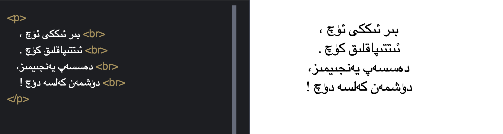
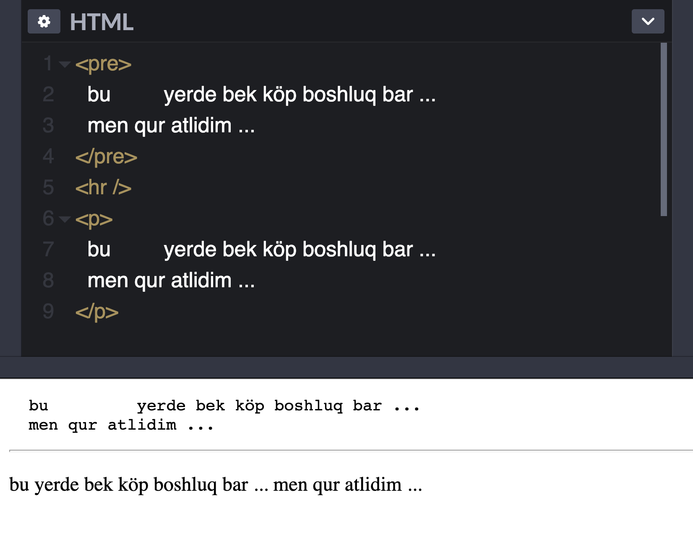
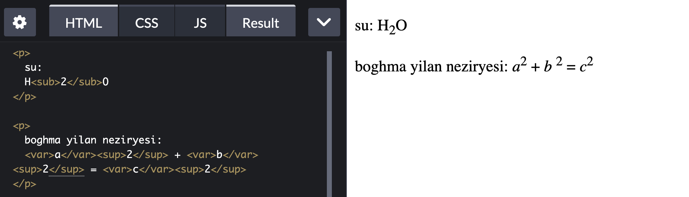

# يىپەك يولىدىكى HTML ساداسى | 4-قىسىم

## تېكىست خەتكۈچلىرى

بۇ قوللانمىنىڭ باشلىنىشىدا بىز تور بەتلەرنىڭ ئەڭ دەسلەپكى رولى بولسا تېكستلەرنى كۆرسىتىپ بىرىش ئىكەنلىكىنى قەيت قىلىپ ئۆتكەن ئىدۇق. ھەقىقەتەن، HTML تېكىستلەرنى كۆرسىتىپ بىرىش ئۈچۈن ناھايىتى مول خەتكۈچلەرنى تەمىنلىگەن. تۆۋەندە ئەنە شۇ خەتكۈچلەر بىلەن بىر-بىرلەپ تونۇشۇپ چىقىمىز. 


### 1. كۆپ ئۇچرايدىغان تېكىست خەتكۈچلىرى

* `div` خەتكۈچى

بۇ خەتكۈچ ئەڭ كەڭ كۆلەمدە ئىشلىتىلىدىغان خەتكۈچلەرنىڭ بىرى بولۇپ، بىر رايوننى (division) ئىپادىلەيدۇ. بۇ خەتكۈچنى تور بەت يۈزىدىكى ھەرقانداق بىر بۆلەك دەرىجىلىك ئىلىمىنت ھالىتىدە ئىشلىتىشكە بولىدۇ.

مەسىلەن دەسلەپكى مەزگىللەردە بەت يۈزىدىكى ئىلىمىنتلار تۆۋەندىكى شەكىلدە قۇراشتۇرۇلاتتى:

```html
<div class="bet">
  <div class="maqale">
    <div class="mawzu">
      <h1> بۇ بىر ماۋزۇ </h1>
    </div>
  </div>
</div>
```

كۆرۈنۈپ تۇرۇپتىكى، ئەگەر يۇقارقى ئىلىمىنتلارنىڭ **تىپ نامى** (classname) بىرىلمىگەندە، بۇ بۆلەك كودنى چۈشۈنۈش ناھايىتى تەسكە توختىغان بولاتتى. شۇڭا كىيىنچە HTML5 نۇرغۇن سېمانتىكىلىق خەتكۈچلەرنى تەمىنلىدى، ۋە سېمانتىكىلىق خەتكۈچلەر بىلەن بەت يۈزى ئىلىمىنتلىرىنى قۇراشتۇرۇش بىر پۈتۈشۈلمىگەن ئادەتكە ئايلاندى. 

سېمانتىكىلىق (sementic) دىگەن سۆزنى ئازراق ئىزاھلاپ قويمەنكى، بۇ شۇ خەتكۈچنىڭ ئىسمىدىنلا جىسمى چىقىپ تۇرىدىغانلىقىنى بىلدۈرىدۇ. يەنى، بىر «ماۋزۇ» (header) ئىلىمىنتىنى div بىلەن ئىپادىلىسە ئۇنىڭ ماۋزۇ ئىكەنلىكىنى چۈشەندۈرۈپ بىرەلمەيدۇ، ئەمما HTML5 تەمىنلىگەن `header`  خەتكۈچى بىلەن ئىپادىلىسە، شۇ بۆلەكنىڭ رولىنىڭ نىمە ئىكەنلىكىنى بىۋاستە ئايدىڭلاشتۇرۇپ بىرەلەيدۇ. شۇڭا يۇقارقى بىر بۆلەك كودنى تۆۋەنكىدىك قۇراشتۇرساق تېخىمۇ چۈشۈنۈشلۈك بولىدۇ.

```html
<main class="bet">
  <article class="maqale">
    <header class="mawzu">
      <h1> بۇ بىر ماۋزۇ </h1>
    </header>
  </article>
</main>
```

بۇ كود ئىچىدە بىز بۇرۇن ئۇچراتمىغان خەتكۈچلەردىن بىرقانچىسى بار، «ئۇلارنىڭ مەنىسىنى لۇغەتتىن ئىزدەڭ» دىگەن گەپنى ئۈچ قىتىمدىن ئارتۇق تەكىتلىسەم ئەمدى قاملاشمايدىغۇ دەيمەن. شۇڭا بۇندىن كىيىن مەن پەقەت بەزى لۇغەت ئاختۇرۇپمۇ چۈشۈنۈش قىيىن بولۇشى مۇمكىن دەپ قارىغان سۆزلۈكلەرنىلا ئايرىم ئىزاھلاپ ئۆتۈپ كىتىمەن.


* `p` خەتكۈچى

بۇ خەتكۈچ پاراگراف (paragraf) نىڭ قىسقارتىلمىسى بولۇپ، بىر ئابزاس مەزمۇنغا ۋەكىللىك قىلىدۇ. تېكىستلا ئەمەس ھەرقانداق بىر بۆلەك ھالىتىدە كۆرسىتىلىدىغان مەزمۇنغا مۇشۇ خەتكۈچنى ئىشلىتىش مۇمكىن، مەسىلەن رەسىم ياكى جەدۋەل دىگەندەك. بۇ ئىلىمىنتنىڭ بىر «ناچار» قىلىقى باركى، بۇ ئىلىمىنت بىلەن ئىپادىلەنگەن بۆلەكنىڭ سۈكۈتتىكى ھالەتتە `1em`  ئۈستى ۋە ئاستى بوشلۇقى  (margin) بار، سەللا دىققەت قىلمىغاندا، بەت يۈزىنىڭ كۆرسىتىلىشىگە تەسىر يەتكۈزىشى مۇمكىن.

 

* `span` خەتكۈچى

بۇ خەتكۈچ ناھايىتى كۆپ قوللىنىلىدىغان بولۇپ، بىر قۇرئىچى ئىلىمىنتىنى ئىپادىلەيدۇ. بۇ يەردىكى قۇر ئىچى ئىلىمىنتى دىگىنىمىز بولسا، بۇ ئىلىمىنتنىڭ قۇر ئالمىشىشنى كەلتۈرۈپ چىقارمايدىغانلىقىنى كۆرسىتىدۇ.


* `br`  خەتكۈچى 

بۇ خەتكۈچ تور بەت يۈزىدە قۇر ئالماشتۇرۇش ئۈچۈن ئىشلىتىلىدۇ. 




* `hr` خەتكۈچى

بۇ خەتكۈچ ئىككى بۆلەكنى ئۆزئارا ئايرىۋىتىش ئۈچۈن ئىشلىتىلىدۇ، تور كۆرگۈز بۇ ئىلىمىنتنى بىر ئۇزۇن سىزىق ھالىتىدە كۆرسىتىپ بىرىدۇ، دەل تۆۋەندىكى سىزىققا ئوخشاش 👇

---


* `pre` خەتكۈچى

بۇ خەتكۈچمۇ ھەم بىر بۆلەك دەرىجىلىك ئىلىمىنتقا ئىشلىتىلىدىغان بولۇپ، مۇشۇ بۆلەك مەزمۇننىڭ پاسونى ساقلاپ قىلىنىدىغانلىقىنى ئىپادىلەيدۇ، بۇ ھەم دەل **pre** نىڭ تولۇق ئاتىلىشى **preformatted** نىڭ مەنىسى. «پاسوننى ساقلاپ قىلىش» دىگەننى تېخىمۇ چۈشىنۈشلىك «ئادەم تىلى» دا ئىزاھلىساق : مەيلى ئەسلى مەزمۇندا قانچە بوش ئورۇن ياكى قۇر قاتلاش بولسا، `pre` ئىلىمىنتى ئۇلارنى شۇ پىتى ساقلاپ قىلىپ بەت يۈزىدە كۆرسىتىپ بىرىدۇ دىگەن گەپ. تۆۋەندىكى سىلىشتۇرمىدىن بۇنى تېخىمۇ چوڭقۇر چۈشۈنۈپ يىتەلەيسىز. يەنى، ئوخشاش مەزمۇن `pre` بىلەن قورشالغاندا ئەسلىي پاسونى ساقلىنىپ قىلىنغان.




* `strong` ۋە `b` خەتكۈچى 

بۇ ئىككىلا خەتكۈچ مەلۇم بىر سۆز ياكى بىر بۆلەك تېكستنى قېنىق (bold, 加粗) ھالەتتە كۆرسىتىش ئۈچۈن ئىشلىتىلىدۇ. `b` بولسا boldface سۆزىنىڭ قىسقارتىلمىسى بولۇپ، پەقەت پاسوننىلا ئىپادىلەيدۇ، شۇڭا ئادەتتە كىشىلەر تىخېمۇ سېمانتىكىلىق بولغان `strong` خەتكۈچى ئارقىلىق مەزمۇننى قېنىق كۆرسىتىپ، شۇ مەزمۇنغا «كۈچلەندۈرۈش» ئىلىپ بارىدۇ.  


* `var`  ،  `sub`  ۋە `sup`   خەتكۈچلىرى

 بۇ خەتكۈچلەر كۆپىنچە ماتىماتىكىلىق فورمۇلالارنى ئىپادىلەشكە ئىشلىتىلىدۇ. يەنى تۆۋەندە كۆرسىتىلگىنىدەك، `var` بىر ئۆزگەرگۈچى مىقدارنى، `sub` ۋە `sup` بولسا ئايرىم-ئايرىم ھالدا ئاستى ۋە ئۈستى بۇرجىكىدە كۆرسىتىلىدىغانلىنى بىلدۈرىدۇ. 




يۇقىرىدا بىز بىر قىسىم كۆپ ئۇچرايدىغان، تىكېستكە مۇناسىۋەتلىك خەتكۈچلەر بىلەن تونۇشۇپ چىقتۇق. تۆۋەندە بىز يەنە بىر قىسىم سېمانتىكىلىق خەتكۈچلەرنى ئادديلا تىلغا ئېلىپ ئۆتۈپ كىتەيلى. ئەلۋەتتە ئۇلارنى ئىشلىتىكە ئىھتىياج تۇغۇلغاندا، MDN نىڭ ئورگان تەرەپ قوللانمىسى ھەرۋاقىت سىزنىڭ بىرىنجى مۇراجەتكارىڭىز بولغۇسى.

>  HTML نىڭ MDN دىكى قوللانمىسى
>
>  ئىنگىلىزچە: https://developer.mozilla.org/en-US/docs/Web/HTML
>
>  خەنزۇچە: https://developer.mozilla.org/zh-CN/docs/Web/HTML


### 2. باشقا سېمانتىكىلىق خەتكۈچلەر


| **ئىزاھات**                                                  | **خەتكۈچلەر** |
| ------------------------------------------------------------ | :------------ |
| تېكىستنىڭ ئاستىغا سىزىق سىزىدۇ.                              | `u`           |
| تېكستنىڭ تۆپىسىگە سىزىق سىزىۋىتىدۇ، كۈچكە ئىگە ئەمەس دىگەندەك مەنىدە. | `s`           |
| مەلۇم مەزمۇننىڭ نەقىل قىلىنغانلىقىنى بىلدۈرىدىغان خەتكۈچ بولۇپ، ئادەتتە تور كۆرگۈچلەردە نورمال تېكسىتلەردىن پەرقلىق كۆرسىتىلىدۇ. | `blockquote`  |
| نەقىل قىلىنغان مەنبە ياكى ئاپتورنىڭ ئىسمىنى ئىپادىلەشكە ئىشلىتىلىدىغان بولۇپ، كۆپىنچە يانتۇ ھالەتتە كۆرسىتىلىدۇ. | `cite`        |
| بۇ خەتكۈچ ئوخشاشلا نەقىل قىلىنغان مەزمۇنغا ئىشلىتىلىدىغان بولۇپ، `blockquote` بىلەن بولغان پەرقى بۇ بىر قۇر ئىچى ئىلمىنتى. | `q`           |
| بۇ بىر بۆلەك مەزمۇننىڭ كومپيۇتېر كودى ئىكەنلىكىنى بىلدۈرىدۇ. | `code`        |
| بۇ بىر قۇرئىچى ئىلمىنتى بولۇپ، ئادەتتە بىر مەزمۇننىڭ ئالاھىدە گەۋدىلەندۈرۈلۈپ كۆرسىتىلىشىگە ئىشلىتىلىدۇ. | `mark`        |
| بۇ خەتكۈچ مەزمۇننىڭ ئۆزى تۇرۇۋاتقان رايوندىكى خەتلەردىن بىر نۇمۇر كىچىك كۆرسىتىلىشىگە ئىشلىتىلىدۇ. | `small`       |
| بۇ خەتكۈچ چىسىلانى ئىپادىلەيدىغان بولۇپ، ئاساسلىقى ئاپتوماتىك ئىكران ئوقۇغۇچنىڭ بۇ مەزمۇننى توغرا تونۇشىغا ياردەم بىرىدۇ. | `time`        |
| بۇ خەتكۈچمۇ ئوخشاشلا ئىكران ئوقۇغۇچنىڭ مۇشۇ مەزمۇننىڭ بىر سانلىق مەلۇمات ئىكەنلىكىنى پەرقلەندۈرۈشىگە ياردەم بىرىدۇ. | `data`        |
| ئىسمىدىن چىقىپ تۇرغىنىدەك، بىر بۆلەك مەزمۇننىڭ ئاددرىس ئىكەنلىكىنى ئىپادىلەيدۇ. | `address`     |
| بۇ بىر مەزمۇننىڭ قىسقارتىلما ئىكەنلىكىنى ئىپادىلەيدىغان بولۇپ، ئادەتتە بۇ ئىلىمىنتنىڭ `title` خاسلىقىغا تولۇق يىزىلىشى بىرىلىدۇ. | `abbr`        |
| بۇ مەلۇم مەزمۇننىڭ «ئېنىقلىما» ئىكەنلىكىنى بىلدۈرىدۇ.        | `dfn`         |
| بۇ خەتكۈچ مەلۇم مەزمۇننىڭ يېزىق يۆنىلىشى نامەلۇم ئىكەنلىكىنى بىلدۈرىدىغان بولۇپ، يېزىق يۆنىلىشىنى تور كۆرگۈچنىڭ بىر تەرەپ قىلىشىغا تاپشۇرۇپ بىرىدۇ. | `bdi`         |


بىز بۈگۈن تور بەتلەرنىڭ كۆپىنچە قىسىمىنى ئىگەللايدىغان تېكىستكە مۇناسىۋەتلىك خەتكۈچلەر ۋە ئۇلارنىڭ روللىرى بىلەن يۈزەكى تونۇشۇپ چىقتۇق. كىلەركى ساندا بىز توربەتلەردىكى مۇھىم ئەزا سانىلىدىغان جەدۋەل ۋە رەسىملەرگە مۇناسىۋەتلىك خەتكۈچلەر بىلەن تونۇشۇپ چىقىمىز. كۆرۈشكىچە ئامان بولغايسىلەر.


##  

> كىيىنكى سانلاردىن ئالدىن مەلۇمات:
>
> * جەدۋەل ۋە رەسىم
> * تور بەت يۈزىدىكى ئۇلانمىلار
> * head بۆلىكى (HTML باش بۆلىكى)

---

يازمىدا: ئارسايبەگ

