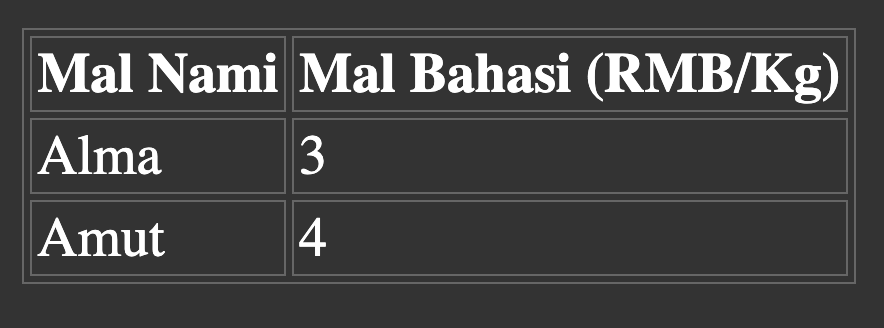
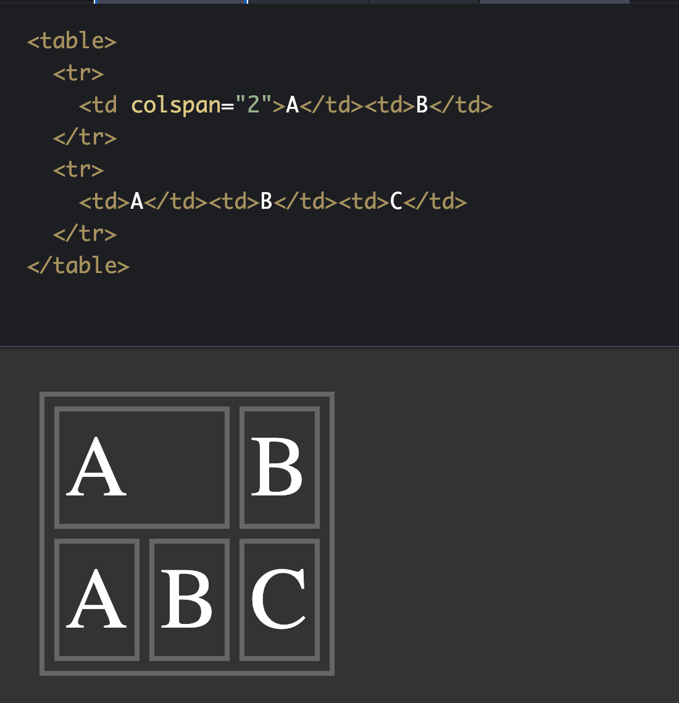
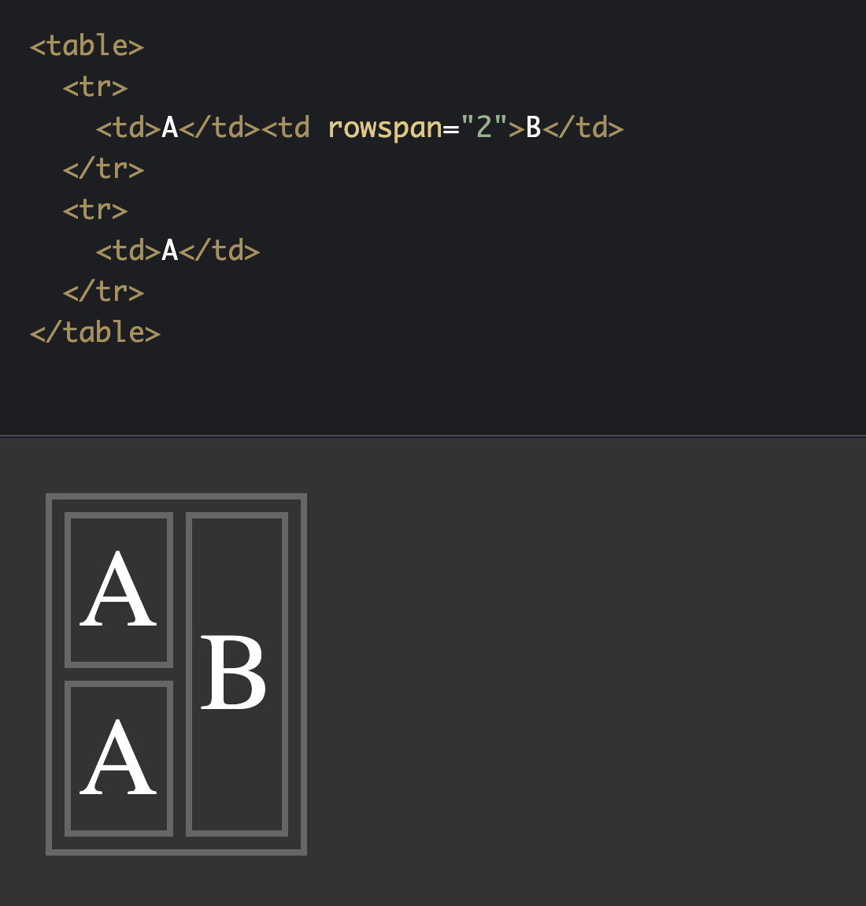
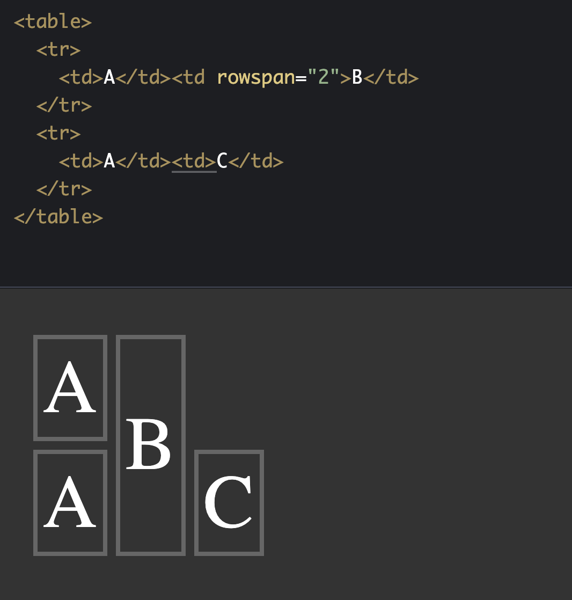
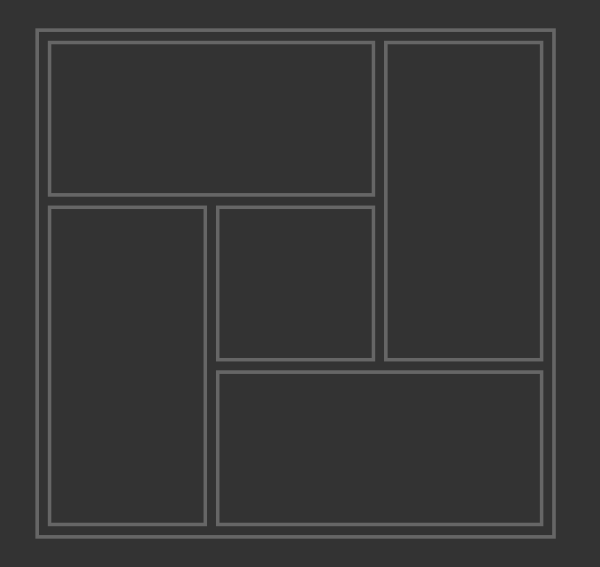

# يىپەك يولىدىكى HTML ساداسى | 5-قىسىم

## جەدۋەل ۋە رەسىم خەتكۈچلىرى

ئالدىنقى قىسىمىدا بىز تور بەتنىڭ مۇتلەق كۆپ قىسىمىنى ئىگىلەيدىغان تېكىستقا مۇناسىۋەتلىك خەتكۈچلەر بىلەن تونۇشۇپ چىققان ئىدۇق. بۇ قىسىمدا بىز ۋەدىمىز بويىچە تور بەت يۈزىدىكى مۇھىم ئەزالاردىن ھىساپلىنىدىغان جەدۋەل (`table`) ۋە رەسىم (`img`) گە مۇناسىۋەتلىك خەتكۈچلەر بىلەن تونۇشۇپ چىقايلى.


### 1. جەدۋەل （`table`）

جەدۋەل بولسا قۇر (`row`)  ۋە ستون (`column`) شەكىلىدە سانلىق مەلۇماتلارنى كۆرسىتىپ بەرگۈچى ئىلىمىنتلاردۇر. تۆۋەندە جەدۋەلگە مۇناسىۋەتلىك مۇھىم خەتكۈچلەر بىلەن تونۇشۇپ چىقىمىز.


* `table` ۋە `caption`

بۇ `table` بولسا بۆلەك دەرىجىلىك خەتكۈچكە تەۋە بولۇپ، جەدۋەلنىڭ بارلىق مەزمۇنى مانا مۇشۇ خەتكۈچنىڭ ئىچىگە قويۇلىدۇ. `caption` خەتكۈچى دائىم جەدۋەلنىڭ ئىچىدىكى بىرىنجى ئىلىمىنت بولۇپ كىلىدىغان بولۇپ، ئادەتتە مۇشۇ جەدۋەلنىڭ ماۋزۇسىنى ئىپادىلەيدۇ.  

```html
<table>
	<caption> دەرسلىك جەدۋىلى </caption>
</table>
```


* `thead` ۋە `tbody` ۋە `tfoot` خەتكۈچلىرى

بۇ ئىلىمىنتلار ھەممىسى ھەم بۆلەك دەرىجىلىك ئىلىمىنتلار بولۇپ، ئايرىم-ئايرىم ھالدا جەدۋەل ئىچىدىكى **جەدۋەل بىشى**، **جەدۋەل گەۋدىسى** ۋە **جەدۋەل ئايېغى** دىگەن ئۈچ بۆلەكنى ئىپادىلەيدۇ. بۇلارنىڭ ھەممىسى `table` ئىلىمىنتىنىڭ ئىچىدىكى **بىۋاستە بالا ئىلىمىنتلار** غا تەۋە بولۇپ، بۇ ئىلىمىنتلارنى ئىشلىتىپ جەدۋەل قۇرۇپ چىققاندا تېخىمۇ سىمانتىكىلىق بەت قۇرۇلمىسى بەرپا قىلىشقا ۋە ئىكران ئوقۇغۇچنىڭ ئىلىمىنتلارنى تېخىمۇ ياخشى پەرقلەندۈرۈشىگە زور پايدىسى بولىدۇ، لىكىن بۇلارنى ئىشلەتمىگەندىمۇ جەدۋەلنىڭ كۆرسىتىلىشىگە تەسىر يەتمەيدۇ. شۇنى ئەسكەرتىپ قويىمەنكى، جەدۋەلدىكى **باش - گەۋدە - ئاياغ** چوقۇم تەرتىپى بويىچە قويۇلىشى كىرەك،  بۇنىڭ سەۋەبىنى چۈشەندۈرۈش بىھاجەتتۇر دەيمەن. :smiley_cat:

> **بىۋاستە بالا ئىلىمىنت** 
> بۇ دىگەنلىك بىر ئىلىمىنتنىڭ ئاتا ئىلىمىنتىغا نىسپەتەن بىۋاستە بالا ئىلىمنتى، يەنى ئارلىقتا باشقا ئىلىمىنتلار قىستۇرۇلۇپ بوۋا-نەۋرە ئىلىمىنت بوپ قالمايدىغانلىنى بىلدۈرىدۇ، خۇددى بىز ئالدىنقى قىسىملاردا سۆزلىگەن `<html>` بىلەن `<head>` ۋە `<body>` ئىلىمىنتلىرىنىڭ مۇناسىۋىتىگە ئوخشاش.


* `colgroup` ۋە `col` خەتكۈچلىرى

`colgroup` مۇ جەدۋەلنىڭ بىۋاستە بالا ئىلىمىنتى بولۇپ، بىر گورۇپپا ستونلارنى ئىپادىلەيدۇ. `col` بولسا `colgroup` نىڭ بالا ئىلىمنتىنى ئىپادىلەيدىغان بولۇپ، جەدۋەلدىكى بىر ستوننى ئىپادىلەشكە ئىشلىتىلىدۇ. ئادەتتە `col` تاق كىلىدىغان خەتكۈچ بولۇپ، بۇ ئىلىمىنتنىڭ ئىچىدە بالا ئىلىمىنت بولمايدۇ. `col` نىڭ ئاساسلىق رولى جەدۋەلنىڭ قۇرۇلمىسىغا ئىنىقلىما بىرىشتىن سىرت يەنە بەزىدە `classname` ئارقىلىق مەلۇم ستونىڭ پاسونىنى بىكىتىشنىمۇ ئۆز ئىچىگە ئالىدۇ.

بۇ يەردىكى `col` خەتكۈچىنىڭ يەنە بىر مۇھىم خاسىلىقى `span`  بولۇپ، سۈكۈتتىكى قىممىتى `1` بولىدۇ. ئەگەر بۇ خاسلىقىغا `1` دىن يۇقىرى قىممەتنى بەرگەندە، بۇ ستوننىڭ كەڭلىكى تەڭ قەدەمدە شۇنچە ستوننىڭ كەڭلىكىدە ئورۇن ئىگىلەيدۇ.. بۇ خاسلىق ئارقىلىق ئىرىشكىلى بولىدىغان ئۈنۈمنى بىز ئاستىدا كاتەكچە ئىپادىلەيدىغان ئىلىمىنتلارنىڭ `colspan` ۋە `rowspan` خاسلىقلىرىنى سۆزلىگەندە ئەمەلىي مىسال بىلەن چۈشەندۈرىمىز.


* `tr` خەتكۈچى

بۇ خەتكۈچ جەدۋەلنىڭ بىر قۇرىنى (table row) ئىپادىلەيدىغان بولۇپ، `tbody`  نىڭ ئىچىگە ياكى بىۋاستە `table` ئىلىمىنتىنىڭ ئىچىگە قويۇلسىمۇ بولىۋىرىدۇ.


* `th` ۋە `td` خەتكۈچى

بۇ ئىككىلا خەتكۈچ جەدۋەلدىكى بىر يەككە كاتەكچىنى ئىپادىلەيدىغان بولۇپ، كۆپىنچە ۋاقىتتا `th` باش كاتەكچە (ماۋزۇ كاتەكچە، نام كاتەكچە) سىنى، `td` بولسا قىممەت كاتەكچىسىنى ئىپادىلەيدۇ.

```html
<table>
  <tr>
    <th>Mal Nami</th><th>Mal Bahasi (RMB/Kg) </th>
  </tr>
  <tr>
    <td>Alma</td><td>3</td>
  </tr>
  <tr>
    <td>Amut</td><td>4</td>
  </tr>
</table>
```

يۇقارقى كود تور كۆرگۈچلەردە تۆۋەندىكىدەك ھاسىللىنىدۇ. (ئەلۋەتتە مەزمۇننى تېخىمۇ ئوچۇق كۆرسىتىش ئۈچۈن كاتەكچىلەرنىڭ چىگراسىنى ئىپادىلەيدىغان CSS پاسونى قوشۇپ بىرىلدى )




* جەدۋەل كاتەكچە ئىلىمىنتلىرىنىڭ `colspan` ۋە `rowspan` خاسلىقى

يۇقىرىدا بىز `th` ياكى `td` ئارقىلىق جەدۋەلدىكى بىر كاتەكچىنى ئىپادىلەيدىغانلىقىمىزنى سۆزلەپ ئۆتتۈق، ئەنە شۇ كاتەكچە ئىلىمىنتلىرىنىڭ مۇھىم خاسلىقلىرىدىن بولغان `colspan` ۋە `rowspan`بولسا مۇشۇ كاتەكچىنىڭ نەچچە ستون ياكى نەچچە قۇر بوش ئورۇننى ئىگىلەيدىغانلىقىنى بەلگەلەيدۇ. 



`colspan` نىڭ سۈكۈتتىكى قىممىتى `1` بولۇپ، بىر كاتەكچىنىڭ بىر ستون كەڭلىكى بوشلۇقنى ئىگەللەيدىغانلىقىنى بىلدۈرىدۇ، شۇڭا بىز بىر كاتەكچە ئارقىلىق بىر قانچە ستون كەڭلىكىنى ئىگەللەش ئۈچۈن ئۇلارغا `1` دىن چوڭ بولغان پۈتۈن سان قىممىتىنى بىرىشىمىز كىرەك. يۇقارقى `colspan=2` دەل مۇشۇ كاتەكنىڭ ئىككى ستون كەڭلىكىنى ئىگىلەيدىغانلىقىنى بىلدۈرىدۇ. `rowspan` مۇ ئاساسەن ئوخشاپ كىتىدىغان بولۇپ، `1` دىن چوڭ بولغان قىممەت بىرىلگىنىدە، شۇ كاتەك بىرىلگەن قىممەتكە ئاساسەن ئوخشىمىغان ساندىكى قۇرنىڭ بوشلۇقىنى ئىگىلىگەن بولىدۇ.



دىققەت قىلىشقا تىگىشلىك يىرى شۇكى، ئادەتتە بىر كاتەكچە بىردىن ئارتۇق قۇر ياكى سىتون كەڭلىكىنى ئىگەللىدى دىگەنلىك، ئۆزىدىن كىيىنكى قۇر ياكى سىتوندىكى كاتەكنى شۇنچە كەڭلىك بىرلىكىدە «قىستاپ» چىقىرىدۇ دىگەن گەپ. شۇڭا بىز جەدۋەلنىڭ تىخىمۇ گۈزەل كۆرۈنۈشى ۋە يەككە كاتەكچىنىڭ جەدۋەل سىرتىغا «پولتىيىپ» چىقىۋالماسلىقى ئۈچۈن، `1` دىن ئارتۇق قىممەت بىرىلگەن `colspan` ياكى `rowspan` مەۋجۇت بولغان قۇرلاردىكى ئىلىمىنلارنىڭ سانىغا دىققەت قىلىشىمىز كىرەك. يەنى، ئۈستىدىكى `B` ئىككى قۇرنى ئىگەللەپ بولدى، شۇڭا ئىككىنجى قۇردا پەقەت بىر كاتەكچە سىغقىدەكلا بوشلۇق بار دىگەن گەپ، ئەگەر ئىككىنجى قۇردا بىردىن ئارتۇق كاتەكچە ئىلىمىنتى بولغىنىدا، ئاخىرقى ئىلىمىنت پولتىيىپ جەدۋەل سىرتىغا چىقىۋالىدۇ، خۇددى تۆۋەندىكى `C` غا ئوخشاش.



ئەلۋەتتە بىز كۆپ ئۇچرايدىغان ئەھۋاللارنى كۆزلەۋاتىمىز، ئەگەر تەلەپ يۇقارقىدەك بىر جەدۋەلنى قۇرۇپ چىقىش بولسا، ئەلۋەتتە بۇمۇ ئەمەلگە ئاشۇرۇشنىڭ بىر خىل ئۇسۇلى. 

جەدۋەلگە مۇناسىۋەتلىك مەزمۇنلارنى تېخىمۇ ياخشى ئۆزلەشتۈرۈش ئۈچۈن، جەدۋەلگە مۇناسىۋەتلىك خەتكۈچلەر ۋە يۇقارقى خاسلىقلار ئارقىلىق  « ھەپتىلىك دەرس سەتكىسى» ۋە تۆۋەنكى شەكىلنى مەشىق قىلىپ يېزىپ چىقىشىڭلارنى تەۋسىيە قىلىمەن.



تېمىنىڭ ئەڭ ئاخىرىدا ئۈستىدىكى تاپشۇرۇقنىڭ پايدىلىنىش كودى تەمىنلەندى. .ئىككىنجى تاپشۇرۇق « ھەپتىلىك دەرس سەتكىسى» نى تاماملاپ شىرخان سالونىغا يوللىسىڭىز ئاپتور سىزگە قىزىل بولاق يوللاپ بىرىدۇ. :smirk:


### 2. رەسىم خەتكۈچى

تۆۋەندە بىز تور بەتلەردىكى مۇھىم ئەزالاردىن بىرى بولغان رەسىملەرگە مۇناسىۋەتلىك خەتكۈچلەر ۋە ئۇلارنىڭ بەزى مۇھىم خاسلىقلىرى بىلەن تونۇشۇپ چىقىمىز.


### بىرىنجى تاپشۇرۇقنىڭ پايدىلىنىش كودى

```html
<table>
  <tr>
    <td colspan="2"></td>
    <td rowspan="2"></td>
  </tr>
  <tr>
    <td rowspan="2"></td>
    <td></td>
  </tr>
  <tr>
    <td colspan="2"></td>
  </tr>
</table>
```


##  

> كىيىنكى سانلاردىن ئالدىن مەلۇمات:
>
> * تور بەت يۈزىدىكى ئۇلانمىلار
> * فورم جەدۋىلى (form ) - تولدۇرما
> * head بۆلىكى (HTML باش بۆلىكى)

---

يازمىدا: ئارسايبەگ

