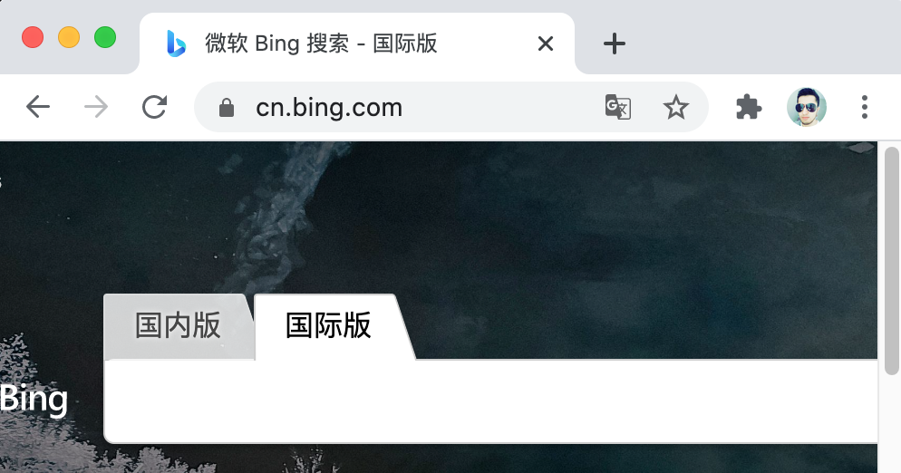
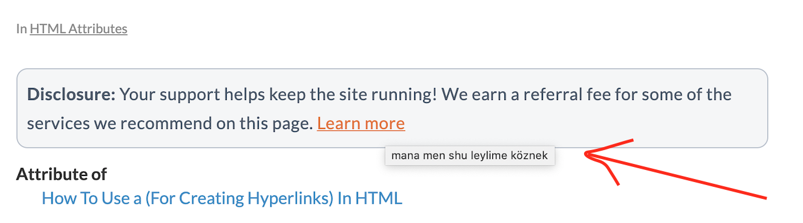
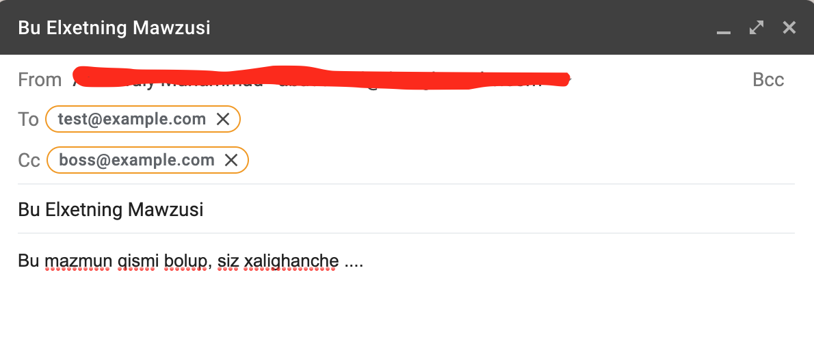

# يىپەك يولىدىكى HTML ساداسى | 6-قىسىم

## URL ۋە ئۇلانما


#### 1. URL ھەققىدە چۈشەنچە


URL بولسا 统一资源定位符”) Uniform Resource Locator)  دىگەن سۆزنىڭ قىسقارتىلمىسى بولۇپ، ئاددىيراق قىلىپ ئىيتقاندا، ئىنتىرنىت تورىدىكى ھەرخىل مەنبەلەرنىڭ ئادرىسىنى ئىپادىلەيدۇ. 

```markdown
https://www.html-sadasi.com/index.html
```


بۇ يەردىكى «مەنبەلەر» بولسا ئىنتىرنىت تورىدىكى ھەرخىل ھۆججەتلەر، توربەتلەر، رەسىملەر ۋە ئۈن-سىن ھۆججەتلىرى دىگەندەك ماتىرىياللارنى ئۆز ئىچىگە ئالىدۇ. بىز پەقەت شۇلارنىڭ URL سىنى بىلگىنىمىزدىلا ئاندىن ئىنتىرنىتتىن ئۇلارغا ئىرىشەلەيمىز. دىمەك، ئىنتىرنىتتىن ئىرىشكىلىلا بولىدىغان ھەرقانداق مەنبەنىڭ چوقۇم URL سى بولىدۇ. ھەربىر URL چوقۇم بىر مەنبەنى كۆرسىتىپ بىرىدۇ، ئەمما بىر مەنبەنىڭ كۆپلىگەن URL سى بولۇشى مۇمكىن.

URL پۈتۈن ئىنتىرنىت تورىنىڭ ئاساسى بولۇپ، ئىنتىرنىتنىڭ «تور» دەپ ئاتىلىشى دەل مەنبەلەرنىڭ مۇشۇنداق ئۇلانمىلار ئارقىلىق زىيارەت قىلىنالايدىغانلىقى ۋە ئۆزئارا ئۇلىنىپ ھەقىقىي «تور» ھاسىللىيالايدىغانلىقىدىندۇر.


* URL نىڭ تۈزۈلىشى

URL ئادەتتە تور كىلىشىمى، تور نامى، پورت ئىغىزى، مەنبە ئادرىسى، پارامىتىر ۋە لەڭگەر نۇقتىسى قاتارلىقلاردىن تەركىپ تاپىدۇ. ئەلۋەتتە URL بۇلارنىڭ ھەممىسىنى ھازىرلىشى ناتايىن.

تۆۋەندە بىز URL نى تەشكىللىگۈچە ھەرقايسى ئەزالارنى ئەمەلىي مىسال بىلەن چۈشەندۈرۈپ ئۆتىمىز.

```markdown
https://www.sada.com/pages/index.html?color=red&text=normal#paragraph3
```

 

ئىنتىرنىت تورىدىكى مەزمۇنلارنى ئىلتىماس قىلىش ياكى زىيارەت قىلىش ئۈچۈن بىز ھەرخىل تور كىلىشىملىرىدىن پايدىلىنىشىمىز كىرەك بولۇپ، يۇقارقى URL دىكى `//:https`  بولسا تور كۆرگۈچنىڭ مۇشۇ مەنبەنى دەل HTTPS كىلىشىمىسى ئاساسىدا ئىلتىماس قىلىدىغانلىقىنى بىلدۈرىدۇ. ئادەتتە كۆپ ئۇچرايدىغان تور كىلىشىملىرىدىن  FTP، HTTP ۋە mailto دىگەندەكلەر بار. تەكىتلەپ قويۇشقا تىگىشلىك يىرى شۇكى، كۆپنىچە تور كۆرگۈچلەر تور بەت ئادرىسدىكى HTTPS تور كىلىشىمىنى يوشۇرۇۋىتىدۇ، ۋە ياكى قۇلۇپ بەلگىسى بىلەنلا ئىپادىلىۋىتىدۇ. بۇ يەردە بۇ كىلىشىمنى بىخەتەر دىمەكچىدە ئەمدە!  :closed_lock_with_key:




تور كىلىشىمى بۆلىكىدىن كىيىنكى بىر بۆلەك تور نامى بۆلىكى بولۇپ، مۇشۇ مەنبە جايلاشقان تور بىكەت ياكى مۇلازىمىتىرنىڭ ئىسمىنى ئىپادىلەيدۇ. يەنى يۇقارقى مىسالدىكى `www.sadasi.com` بولسا، بىز زىيارەت قىلىدىغان مەنبەنىڭ مۇشۇ تورنامى ئاستىدا ئىكەنلىكىنى بىلدۈرىدۇ. ئەلۋەتتە بۇ بۆلەك تورنامى ياكى IP ئادرىسى بولشىمۇ مۇمكىن. شۇڭا بەزى تور بەتلەرنى زىيارەت قىلغاندا بىز `http://40.123.234.231/index.html`  دىگەنگە ئوخشاش ئادرىسلارنىمۇ ئۇچرىتىمىز، بۇ دەل مۇشۇ مەنبەنىڭ جايلاشقان IP ئادرىسىنى كۆرسىتىپ بىرىدىغان بولۇپ، ھازىرچە بىرەر تور نامى بىلەن ئۇلانمىغانلىقىنى بىلدۈرىدۇ. 

> بۇ يەردىكى تورنامى، IP ئادرىسى، ۋە شۇنداقلا ئۇلارنى باغلاش دىگەندەك مەزمۇنلار كۆرۈرمەنلەرنىڭ ئىزدىنىشىگە قالدى. تۆۋەندىكى ھالقىلىق سۆزلەر ئارقىلىق ئىزدىنىپ بىقىڭ، ئەگەر مەسىلىگە يولۇقسىڭىز ئاپتورنى قوشۇپ ئايرىم پىكىرلىشىڭ. ئاپتورنى قوشۇش ئۇسۇللىرىنى تىمىنىڭ ئەڭ ئاستىدىن تاپالايسىز.

*ھالقىلىق سۆزلەر:*

```
IP (Internet Protocol)、 IP 协议、host、 域名、 domain、 DNS、 HTTP、 HTTPS 
```


URL دىكى پورت ئىغىزى بولسا تورنامىنىڭ كەينىدىن كىلىدىغان رەقەملىك بۆلەك بولۇپ، ئاشۇ تورنامىدىكى مۇلازىمىتىرنىڭ قايسى ئىغىزى ئارقىلىق مەنبەنى زىيارەت قىلىدىغانلىقىمىزنى بەلگىلەيدۇ. ئەگەر پورت ئىغىزى بىۋاستە بىرىلمىگەندە، مۇلازىمىتىرنىڭ سۈكۈتتىكى ئىغىزى مۇلازىمەت تەمىنلەيدۇ، كۆپىنچە `80` ياكى `443` ئىغىزى بولۇشى مۇمكىن.


URL دىكى تورنامى بۆلىكىدىن كىيىن كىلىدىغان بۆلەك مەنبەنىڭ ئادرىسىنى ئىپادىلەيدىغان بولۇپ، تورنامىدىن كىيىنكى `/` بەلگىسىدىن باشلاپ تاكى `?` بەلگىسىگىچە بولغان قىسىم دەل مەنبەنىڭ مۇلازىمىتىردىكى ئادرىسىنى بىلدۈرىدۇ. مەسىلەن يۇقارقى مىسالدىكى `pages/index.html` بولسا، مۇشۇ `index.html` ھۆججىتىنى مۇلازىمىتىر `pages` دىگەن ئادرىستىن  تەمىنلەپ بىرىدىغانلىقىنى بىلدۈرىدۇ.


پارامىتىر بۆلىكى بولسا `?` بەلگىسىدىن باشلانغان بۆلەك بولۇپ،   `&` بىلەن ئايرىۋىتىلگەن بىرنەچچىلىگەن  `نامى=قىممىتى` دىگەن شەكىلدىكى تىكىستىن ئىبارەت بولۇشى مۇمكىن. بۇ بۆلەك مەنبەنىڭ ئادرىسىغا تەسىر كۆرسەتمەيدۇ لىكىن مۇلازىمىتىرغا يوللىنىدىغان بولۇپ، مۇلازىمىتىر مۇشۇ پارامىتىرلارغا ئاساسەن قانداق مەنبەنى تەمىنلەشنى بىكىتسە بولىدۇ.


ئەڭ ئاخىرىدىكى `#` بەلگىسىدىن باشلانغان بۆلەك بولسا، لەڭگەر (anchor)  دەپ ئاتىلىدىغان بولۇپ، بۇ ئۇچۇر ئادەتتە مۇلازىمىتىرغا يوللانمايدۇ. بۇ بۆلەك كۆپىنچە ئەھۋاللاردا  بەت ئىچى يول باشلاش ئىشلىرى ئۈچۈن ئىشلىتىلىدۇ. (ھالقىلىق سۆز: `锚点` ، `anchor` ، `页内导航`)


* مۇتلەق URL ۋە نىسپىي URL


مۇتلەق URL ياكى مۇتلەق ئادرىس دىگىنىمىز، بۇ URL نىڭ مەلۇم مەنبەگە ئىرىشىشىمىز ئۈچۈن مۇھىم بولغان بارلىق ئۇچۇرلارنى ئۆز ئىچىگە ئالغانلىقىنى بىلدۈرىدۇ. مەسىلەن:

```markdown
https://www.sada.com/pages/index.html
```


نىسپىي URL ياكى نىسپىي ئادرىس دىگىنىمىز بولسا، مەلۇم URL نى پەقەت ئۆزى جايلاشقان ئورۇنغا تايىنىپ ئىزدەش ئارقىلىقلا ئورۇن بىكىتكىلى بولىدىغانلىقىنى بىلدۈرىدۇ. مەسىلەن، مەن يۇقارقى توربەتنى زىيارەت قىلىۋاتقان بولسام، ئۇنداقتا شۇ ئورۇندىن نىسپىي ئادرىسلارنى تەھلىل قىلىپ مەنبەلەرنىڭ ئورۇنىنى بىكىتكىلى ۋە شۇنداقلا ئۇلارنىڭ مۇتلەق ئادرىسىنى ھىسابلاپ چىقارغىلى بولىدۇ. بۇ يەردە دىققەت قىلىشقا تىگىشلىك ئىككى مۇھىم بەلگە بولۇپ، `.`  بەلگىسى ھازىر تۇرۇۋاتقان مۇندەرىجىنى ۋە `..` بولسا ئالدىنقى دەرىجىدىكى مۇندەرىجىنى (يەنى ئاتا مۇندەرىجە) نى بىلدۈرىدۇ. ئەلۋەتتە «بوۋا مۇندەرىجە» گە قايتماقچى بولسا، پەقە ئىككى ئاتا مۇندەرىجىگە قايتىش بەلگىسىنى بىر `/`  بەلگىسى بىلەن ئايرىۋەتسەكلا بولىدۇ. تۆۋەندىكى بىر نەچچە مىساللار سىزنىڭ چۈشۈنىشىڭىزگە ياردەم قىلالىشى مۇمكىن.

```javascript
// turushluq ornum
"https://www.sada.com/pages/index.html"

// nispiy URL => mutleq URL

"./error.html" 
=> "https://www.sada.com/pages/error.html"


"../error.html" 
=> "https://www.sada.com/error.html"


"../img/loading.gif" 
=> "https://www.sada.com/img/loading.gif"

```


* HTML دىكى `<base>` خەتكۈچى

يۇقارقى مەزمۇنلارنى چۈشۈنۈۋالغاندىن كىيىن بىز HTML گە قايتىپ كەلسەك، `<base>` دىگەن مۇھىم خەتكۈچنى تىلغا ئالماي بولمايدۇ. بۇ خەتكۈچ توربەتلەردىكى نىسپىي URL لارنىڭ مۇتلەق ئورنىنى ھىسابلاشتىكى باشلىنىش نۇقتىسىنى بىلدۈرىدىغان بولۇپ، ئادەتتە تور بەتنىڭ `<head>` بۆلىكىگە قويۇلىدۇ ۋە بۇ خەتكۈچنىڭ `href` خاسلىقىنىڭ قىممىتى پۈتۈن بەتتىكى URL ۋە لەڭگەر نۇقتىلارنىڭ ئىپادىلىرىگە تەسىر كۆرسىتىدۇ.

```html
<head>
	<base href="https://www.sada.com/" >
</head>
```

  يۇقارقى مىسالدا بارلىق نىسپىي ئادرىسلارنىڭ ھىسابلاش باشلىنىش مۇندەرىجىسى دە `https://www.sada.com` بولىدۇ.


#### 2. HTML دىكى ئۇلانما خەتكۈچى


* `<a>` خەتكۈچى

تور بەت يۈزىدىكى كۆپىنچە ئۇلانمىلار `<a>` خەتكۈچى بىلەن ئىپادىلىنىدىغان بولۇپ، بۇ ئىلىمىنت چىكىلگەندە، تور كۆرگۈچ كۆرسىتىپ بىرىلگەن ئادرىسقا سەكرەيدۇ. تۆۋەندىكى ئاددىي ئۇلانمىغا قارايدىغان بولساق، `ئىزدەڭ` دىگەن ئۇلانما چىكىلگەندە، تور كۆرگۈچ سىزنى `bing.com` تورىنىڭ باش بىتىگە ئىلىپ بارىدۇ.

```html
<a href="https://bing.com" > ئىزدەڭ </a>
```

 يۇقارقى `href` خاسلىقى مۇشۇ ئۇلانمىنىڭ سەكرىمەكچى بولغان ئادرىسىنى كۆرسىتىپ بىرىشكە ئىشلىتىلىدۇ. ئىككى `a` خەتكۈچىنىڭ ئىچىگە بىز تىكىست، پاراگراف، رەسىم ۋە فىلىملەرگە ئوخشاش ھەرخىل ئىلىمىنتلارنى قويالايدىغان بولۇپ، بۇ ئىلىمىنتلار بەت يۈزىدە بىۋاستە كۆرسىتىلىدۇ ۋە شۇنداقلا زىيارەت قىلغۇچىلارمۇ ئۇلارنى بىۋاستە چىكىپ مۇناسىۋەتلىك ئادرىسقا سەكرەپ كىرەلەيدۇ.


* `<a>` خەتكۈچىنىڭ مۇھىم خاسلىقلىرى


1. `href` خاسلىقى - يۇقىرىدا دەپ ئۆتكىنىمىزدەك، بۇ خاسلىق مۇشۇ ئۇلانمىنىڭ ئادرىسىنى كۆرسىتىپ بىرىدۇ. ئەلۋەتتە بۇ ئادرىس مۇتلەق ياكى نىسپىي ئادرىس، ھەتتا `#` بەلگىسىدىن باشلىنىدىغان لەڭگەر نۇقتىسى بولسىمۇ بولۇۋىرىدۇ. 

2. `title` خاسلىقى - بۇ خاسلىقنىڭ ئاساسلىق رولى ئۇلانمىنى تەسۋىرلەش بولۇپ، ئادەتتە سىز مائۇسنى ئۇلانمىنىڭ تۆپىسىگە قويغاندا، بىر لەيلىمە كۆزنەك كۆرىنىدۇ ۋە مۇشۇ ئۇلانمىنىڭ تەسۋىرلەش ئۇچۇرىنى كۆرسىتىپ بىرىدۇ.
   

3. `target` خاسلىقى - بۇ خاسلىق مۇشۇ ئۇلانمىنىڭ قانداق ھالەتتە ئىچىلىدىغانلىقىنى بەلگىلەيدىغان بولۇپ، بىر نەچچە خىل قىممەتلىرى بار. 

   `self_`  : بۇ سۈكۈتتىكى قىممىتى بولۇپ، بۇ قىممەت بىرىلگەندە ئۇلانما مۇشۇ زىيارەت قىلىنىۋاتقان تور كۆرگۈچتە بىۋاستە ئىچىلىدۇ.
   `blank_` : ئۇلانما تور كۆرگۈچنىڭ يىڭى كۆزنىكىدە ئىچىلىدۇ.
   `parent_` : ئۇلانما ھازىرقى بەتنىڭ ئاتا كۆزنىكىدە ئىچىلىدۇ. ئەگەر ئاتا كۆزنىكى بولمىسا، `self_` بىلەن ئوخشاش ھالدا بولىدۇ.
   `top_` : ئۇلانما ئەڭ يۇقىرى ئەجداد كۆزنەكتە ئىچىلىدۇ. ئوخشاشلا ئەجداد كۆزنەك بولمىغان ئەھۋالدا `self_` بىلەن پەرقى يوق بولىدۇ.

4. `download` خاسلىقى - بۇ خاسلىق ئىسمىدىنلا چىقىپ تۇرغىنىدەك، مەلۇم ئۇلانمىنىڭ باشقا ئادرىسقا سەكرەش ئۈچۈن ئەمەس بەلكى مەلۇم مەنبەدىكى ھۆججەتنى بىۋاستە چۈشۈرۈش ئۈچۈن ئىشلىتىلىدىغانلىقىنى ئىپادىلەيدۇ.

```html
<a href="vlge.txt" download> ! چۈشۈرۈڭ  </a>
```

مەسىلەن سىز يۇقارقى ئىلىمىنتنى چەكسىڭىز، توركۆرگۈچ سىز زىيارەت قىلىۋاتقان بىكەتتەن `vlge.txt` دىگەن ھۆججەتنى چۈشۈرىدۇ. تەكىتلەپ قويىدىغان يىرى شۇكى، چۈشۈرمەكچى بولغان مەزمۇن چوقۇم زىيارەت قىلىنىۋاتقان بەت بىلەن ئوخشاش تور نامى ئاستىدا بولۇشى كىرەك.


* ئىلخەت ۋە تىلفۇن ئۇلانمىلىرى

`href` خاسلىقىغا بىز `mailto` كىلىشىمى ئارقىلىق بىز مەلۇم ئىلخەت ئادرىسىنى باغلىيالايدىغان بولۇپ، بۇ ئۇلانما چىكىلگەندە تور كۆرگۈچ بىۋاستە كومپيۇتىردىكى ئىلخەت دىتالىنى قوزغۇتىدۇ ۋە ئۇلانمىدىكى ئۇچۇرلارنى ئالدىن توشقۇزۇپ بىرىدۇ.

```html
<a 
	href="mailto:test@example.com?
        	subject=Bu Elxetning Mawzusi&
					cc=boss@example.com&
					body=Bu mazmun qismi bolup, siz xalighanche ...."
>
	ئاپتور بىلەن ئالاقىلىشىڭ
</a>
```

يۇقارقى كودتا كۆرسىتىلگىنىدەك، بىز ئىلخەتكە مۇناسىۋەتلىك ئۇچۇرلارنى ئالدىن تەمىنلىيەلەيمىز ۋە بۇ ئۇلانما چىكىلگەندە تور كۆرگۈچ سۈكۈتتىكى ئىلخەت دىتالىنى قوزغۇتۇپ ئۇچۇرلارنى ئالدىن تولدۇرۇپ تەييار قىلىپ بىرىدۇ. دىققەت قىلىشقا تىگىشلىك يىرى شۇكى ئىلخەتنىڭ ماۋزۇسى، مەزمۇنى دىگەندەك ئۇچۇرلار URL پارامىتىرى شەكىلىدە يىزىلىدۇ. تۆۋەندىكى رەسىم ئۈستىدىكى كودنىڭ نەتىجىسى.



ئەلۋەتتە بەزى تىلفۇن چىتىلغان كومپيۇتېرلارغا نىسپەتەن، بىز ئوخشاشلا `tel` كىلىشىمى ئارقىلىق ئۇلانمىلارغا ئۇلار چىكىلگەندە مەلۇم نۇمۇرغا تىلفۇن قىلىدىغان ئىقتىدارلارنى قوشالايمىز. 

```html
<a href="tel:13999999999" > بىزگە تىفۇن قىلىڭ </>
```


بۈگۈن بىز URL ۋە تور بەت يۈزىدىكى ئۇلانمىلارغا مۇناسىۋەتلىك مەزمۇنلار بىلەن قىسقىچە تونۇشۇپ چىقتۇق. كىلەركى قىتىم كۆرۈشكىچە ئامان بولغايسىلەر. 


> كىيىنكى سانلاردىن ئالدىن مەلۇمات:
>
> * تولدۇرما جەدۋىلى (form)
> * head بۆلىكى (HTML باش بۆلىكى)

---

يازمىدا: ئارسايبەگ

