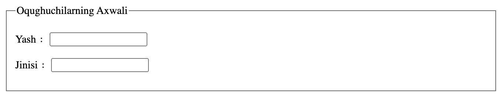
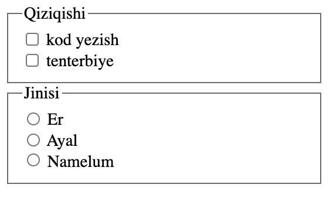
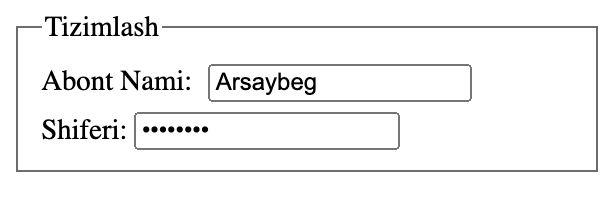
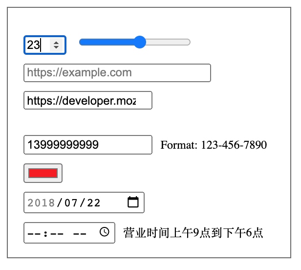

# يىپەك يولىدىكى HTML ساداسى | 7-قىسىم

## تولدۇرما جەدۋىلى - I


تولدۇرما دىگەن سۆز form سۆزىدىن ئۆزلەشتۈرۈلگەن بولۇپ، تور بەت زىيارەت قىلغۇچىنىڭ ھەرخىل ئۇچۇرلارنى تولدۇرۇش ئارقىلىق تور بەت بىلەن ئالاقە قىلىدىغان ئۇسۇللىرىدىن بىرى ھىسابلىنىدۇ.  

بىر تولدۇرما تولدۇرۇش رامكىسى، كونۇپكا، تاق تاللىما ۋە كۆپ تاللىما دىگەندەك كۆپلىگەن زاپچاسلار بىرىكمىسىدىن تەركىپ تىپىشى مۇمكىن. تۆۋەندە بىز HTML دىكى تولدۇرما ۋە ئالاقىدار زاپچاسلارغا مۇناسىۋەتلىك ئىلىمىنتلار بىلەن تونۇشۇپ چىقايلى.


1. `<form>` خەتكۈچى

بۇ خەتكۈچ بىر تولدۇرمىغا ئىنىقلىما بىرىدىغان بولۇپ، تولدۇرمىنىڭ بارلىق زاپچاس ئىلىمىنتلىرى مۇشۇ خەتكۈچنىڭ ئىچىگە ئورۇنلاشتۇرۇلىدۇ.

```html

<form action="https://example.com/api" method="post">
  <label for="username">Abont Nami：</label>
  <input id="username" type="text" name="user">
  <input type="submit" value="Tapshurush">
</form>
```

يۇقارقى كود بىر ئاددىي تولدۇرما جەدۋېلىنى بىلدۈرىدىغان بولۇپ، بىر `label` خەتكۈچى بىلەن ئىپادىلەنگەن چاپلىما ئىلىمىنتى ۋە ئىككى `input` خەتكۈچى ئارقىلىق ئىپادىلەنگەن تولدۇرۇش رامكىسى بىلەن تاپشۇرۇش كونۇپكىسىدىن تەركىپ تاپقان. بۇ تولدۇرمېنىڭ ئىقتىدارى شۇكى، ئابونت ئىسمىنى تولدۇرۇپ «Tapshurush» دىگەن كونۇپكىنى بېسىشى بىلەن، رامكىغا تولدۇرۇلغان ئىسىم مۇلازىمىتىرغا (يەنى `https://example.com/api` دىگەن ئېغىزغا ) يوللىنىدۇ. 


تۆۋەندە بىز `form` ئىلىمىنتىغا مۇناسىۋەتلىك مۇھىم خاسلىقلار بىلەن تونۇشۇپ چىقايلى:

* `accept-charset` : مۇلازىمىتىر قوبۇل قىلىدىغان ھەرپ-بەلگە كودلىرى (字符编码集)

* `action` : تولدۇرما ئۇچۇرلىرى يوللىنىدىغان مۇلازىمىتىر ئادرىسى / API ئېغىزى

* `autocomplete` : بۇ خاسلىق `off` ياكى `on` دىن ئىبارەت ئىككى خىل قىممەتنى قوبۇل قىلىدىغان بولۇپ، ئابونت تولدۇرمېنىڭ بەزى زاپچاسلىرىنى تولدۇرمىغان ئەھۋالدا تور كۆرگۈچ شۇ زاپچاسنى ئاپتوماتىك تولدۇرىدىغان ياكى تولدۇرمايدىغانلىقىنى ئىپادىلەيدۇ.

* `method` : بۇ خاسلىق تولدۇرمىنىڭ مۇلازىمىتىرغا تاپشۇرۇلۇشىدىكى HTTP ئۇسۇلىنى بەلگىلەشكە ئىشلىتىلىدىغان بولۇپ، `GET` ۋە `POST` قاتارلىق قىممەتلەر بىرىلسە بولىدۇ.

* `enctype` : بۇ خاسلىق تولدۇرما ئۇچۇرلىرى `POST` ئۇسۇلى ئارقىلىق مۇلازىمىتىرغا يوللانغاندا شۇ ئۇچۇرنى كودلاشتۇرۇشقا ئىشلىتىلگەن MIME تېپىنى بىكىتىشكە ئىشلىتىلىدىغان بولۇپ، `text/plain` ، `application/form-data` ۋە سۈكۈتتىكى `application/x-www-form-urlencoded` دىگەندەك قىممەتلەر بىرىلسە بولىدۇ.


> MIME تېپى
> https://developer.mozilla.org/zh-CN/docs/Web/HTTP/Basics_of_HTTP/MIME_types


* `name` : تولدۇرما نامى (بۇ خاسلىقنىڭ قىممىتى بەت يۈزىدە قايتىلىنىپ قالماسلىقى لازىم)

* `novalidate` : بۇ خاسلىق بول قىممىتى قوبۇل قىلىدىغان بولۇپ، تولدۇرما ئۇچۇرلىرى تاپشۇرۇلغاندا قىممەتلەرنىڭ تەكشۈرۈش ياكى تەكشۈرۈلمەيدىغانلىقىنى ئىپادىلەيدۇ.
* `target` : بۇ خاسلىق مۇلازىمىتىردىن قايتقان ئۇچۇرنىڭ قايسى كۆزنەكتە كۆرسىتىلىدىغانلىقىنى بەلگىلەيدۇ.


2. `fieldset` ۋە `legend` خەتكۈچى

`filedset` ئىلىمىنتى بىرقانچە تولدۇرما زاپچاس ئىلىمنتلارنى ئۆز ئىچىگە ئالىدىغان بولۇپ، شۇ ئىلىمىنتلارنى گورۇپپىلاش ئۈچۈن ئىشلىتىلىدۇ.

`legend` ئىلىمىنتى ئادەتتە `filedset` ئىلىمنتىنىڭ بالا ئىلىمنتى بولۇپ كېلىدىغان بولۇپ، شۇ بىر گورۇپپا زاپچاس ئىلىمىنتلارنىڭ ماۋزۇسىنى ئىپادىلەيدۇ.

```html
<fieldset>
  <legend> Oqughuchilarning Axwali </legend>
  <p> Yash  ：<input type="text" name="age"></p>
  <p> Jinisi ：<input type="text" name="gender"></p>
</fieldset>
```

يۇقارقى كود بۆلىكىنىڭ تور بەت يۈزىدىكى نامايەن بولۇشى تۆۋەندىكىدەك بولىدۇ.




3. `label` خەتكۈچى

بۇ ئىلىمىنت قۇر ئىچى ئىلىمىنتىلىرىدىن بولۇپ، تولدۇرما زاپچاس ئىلىمىنتلىرىنى تېكىستلىك چۈشەندۈرۈش رولىنى ئۆتەيدۇ. بۇ ئىلىمىنتنىڭ `for` خاسلىقى مۇشۇ ئىلىمىنت چۈشەندۈرمەكچى بولغان ئىلىمىنتنىڭ `id` خاسلىقى بىلەن ئوخشاش قىممەت بىرىلىدىغان بولۇش، بۇ قىممەت ئۇلارنىڭ باغلىنىشلىق مۇناسىۋىتى بارلىقىنى ئىپادىلەيدۇ. بۇ باغلىنىشلىق مۇناسىۋىتىڭ رولىنى بىز شۇ ئىلىمنتلار ئۈستىدە توختالغاندا تەپسىلىي تىلغا ئالىمىز.


4. `input` خەتكۈچى

بۇ تولدۇرما زاپچاس ئىلىمنتلىرى ئىچىدىكى ئەڭ كەڭ كۆلەمدە ئىشلىتىلىدىغان ئىلىمنتلارنىڭ بىرى بولۇپ، قۇر ئىچى تاق خەتكۈچلۈك ئىلمىنتلارغا تەۋە. بۇ ئىلىمنتنىڭ تور بەت يۈزىدە ئەكىس ئېتىلىشى `type` خاسلىقى بىلەن مۇناسىۋەتلىك بولۇپ، ئوخشىمىغان قىممەتلەر ئوخشىمىغان كېرگۈزۈش رامكىلىرىنى ھاسىللايدۇ.


5. `input` ئىلىمنتىنىڭ `type` خاسلىقى قىممەتلىرى


* `type=text` 

بۇ ئادەتتىكى تولدۇرما رامكىسىنى بىلدۈرىدىغان بولۇپ، بىر قۇر تېكىستنى كېرگۈزۈشكە ئىشلىتىلىدۇ.


* `type=button`  

بۇ بىر كونۇپكىنى ئىپادىلەيدىغان بولۇپ، كونۇپكا ئىلىمىنتىغا مەلۇم ۋاقىئە (event) نى باغلاش ئارقىلىق بەزى ئىقتىدارلارنى ئەمەلگە ئاشۇرغىلى بولىدۇ. كونۇپكىغا ۋاقىئە باغلاش قوللانمىمىزنىڭ دائىرىسىدە بولمىغانلىقى ئۈچۈن بۇ قىممەت ئۈستىدە كۆپ توختالمايمىز. يەنە كېلىپ، تور بەت يۈزىدىكى كونۇپكىلارنى ھاسىللاشتا تېخىمۇ سىمانتىكىلىق بولغان `<button>` ئىلىمىنتى بەكرەك تەۋسىيە قىلىنىدۇ.


* `type=submit`

بۇ تولدۇرمېنىڭ تاپشۇرۇش كونۇپكىسىنى ئىپادىلەيدىغان بولۇپ، ئابونتلار مۇشۇ كونۇپكىنى چەككەندە تولدۇرما ئۇچۇرلىرى مۇلازىمىتىرغا يوللىنىدۇ.


* `type=image`

بۇ تاپشۇرۇش كونۇپكىسىنىڭ بىر رەسىم ئىكەنلىكىنى بىلدۈرىدىغان قىممەت بولۇپ،  باشقا ئىپادىلىرى `submit` بىلەن ئاساسەن ئوخشاش.


* `type=reset`

بۇ ئەسلىگە قايتۇرۇش كونۇپكىسىنى ئىپادىلەيدىغان قىممەت بولۇپ، بۇ كونۇپكا چىكىلگەندە، پۈتۈن تولدۇرما ئەڭ دەسلەپكى ھالىتىگە قايتۇرۇلىدۇ.


* `type=checkbox`

بۇ تور بەت يۈزىدىكى كۆپ تاللىما (多选框) نى ئىپادىلەيدىغان قىممەت بولۇپ، بۇ زاپچاس چىكىلگەندە تاللىنىش ۋە تاللاشنى ئەمەلدىن قالدۇرۇشتىن ئىبارەت ئىقتىدارى بار.


* `type=radio`

بۇ تور بەت يۈزىدىكى تاق تاللىما (单选框) نى ئىپادىلەيدۇ. تاق تاللىما دىگىنىمىز، بىر گورۇپپا تاللاشتىن بىز پەقەت بىرنىلا تاللىيالايدىغانلىقىمىزنى بىلدۈرىدىغان بولۇپ، ئىككىنجى تاللاش تاللانغاندا بىرىنجى تاللاشنىڭ ئەمەلدىن قالدۇرۇدىغانلىقىنى بىلدۈرىدۇ.


```html
<fieldset>
  <legend> Qiziqishi </legend>
  <div>
    <input type="checkbox" id="coding" name="interest" value="coding">
    <label for="coding"> kod yezish </label>
  </div>
  <div>
    <input type="checkbox" id="sports" name="interest" value="sports">
    <label for="sports"> tenterbiye </label>
  </div>
</fieldset>

<fieldset>
  <legend> Jinisi </legend>
    <div>
        <input type="radio" id="male" name="male">
        <label for="male"> Er </label>
    </div>
    <div>
        <input type="radio" id="female" name="female">
        <label for="female"> Ayal </label>
    </div>
    <div>
        <input type="radio" id="unknown" name="unknown">
        <label for="unknown"> Namelum </label>
    </div>
</fieldset>
```

يۇقارقى كود بۆلىكى تور بەت يۈزىدە تۆۋەندىكىدەك نامايەن بولىدىغان بولۇپ، بۇ يەردىكى `label` خاسلىقلىرى شۇ زاپچاسلارنى تېكىستلىك ئىزاھلاش ۋە شۇنداقلا چىكىلىش دائىرىسىنى چوڭايتىپ بىرىشتەك رولنى ئۆتەيدۇ.



* `type=eamil`

بۇ پەقەت ئېلخەت ئاددېرىسىنىلا كېرگۈزۈشكە بولۇدىغان رامكا بولۇپ، تولدۇرما ئۇچۇرلىرى تاپشۇرۇلۇشتىن بۇرۇن مەزمۇننىڭ ئىناۋەتلىك ئېلخەت ئىكەنلىكى تەكشۈرۈلىدۇ.


* `type=password`

بۇ مەخپى شىفىر كېرگۈزۈش رامكىسىنى ئىپادىلەيدىغان قىممەت بولۇپ، ئابونتلارنىڭ كىرگۈزگەن شىفىرلىرى `*` ياكى `.` دىگەندەك بەلگىلەر ئارقىلىق يوشۇرۇلىدۇ.




* `type=file`

بۇ بىر ھۆججەت تاللىغۇچنى ئىپادىلەيدىغان قىممەت بولۇپ، ئابونتلارنى بىر ياكى بىرنەچچە ھۆججەتنى يەرلىكتىن تاللاپ بىرىش ئىمكانىيىتىگە ئىگە قىلىدۇ ۋە كۆپىنچە يەرلىك ھۆججەتلەرنى مۇلازىمىتىرغا يوللاش ئىقتىدارىنى ئەمەلگە ئاشۇرۇشقا ئىشلىتىلىدۇ. `accept` خاسلىقى ئارقىلىق مەزكۇر ھۆججەت تاللىغۇچنىڭ قوبۇل قىلىدىغان ھۆججەت تېپلىرىنى بەلگىلەپ بىرەلەيمىز.


* `type=hidden`

بۇ بەت يۈزىدە كۆرۈنمەيدىغان ئىلىمىنتنى ئىپادىلەيدىغان بولۇپ، ئادەتتە بىز بۇ ئىلىمنتنىڭ قىممىتىنى تولدۇرما ئۇچۇرى سۈپىتىدە تاپشۇرىدىغان ئەمما ئىلىمىنتنى بەت يۈزىدە كۆرسەتمەيدىغان ئەھۋاللاردا ئىشلىتىمىز.


* `type=range`: دائىرە تاللىغۇچ

* `type=number` : سان كېرگۈزۈش رامكىسى
* `type=url` : ئۇلانما كېرگۈزگۈچ
* `type=tel` : تېلفۇن نۇمۇرى كېرگۈزگۈچ
* `type=color`: رەڭ تاللىغۇچ
* `type=date` : چېسىلا كېرگۈزگۈچ (`yyyy-MM-dd` فورماتى بويىچە كېرگۈزىلىدۇ)
* `type=time`: ۋاقىت كېرگۈزگۈچ ( فورماتى: `hh:mm` ياكى `hh:mm:ss`)



يۇقىرىدا تىلغا ئىلىپ ئۆتكىنىمىزدەك، `type` خاسلىقىنىڭ قىممىتى مەزكۇر `input` ئىلىمىنتىنىڭ قايسى شەكىلدە نامايەن بولۇشىنى بەلگىلەيدۇ. `input` ئىلىمىنتىنىڭ خاسلىقلىرى ھەم ئىلىمىنت تېپىغا ئاساسەن ئوخشاش بولمايدۇ. شۇڭا بىز `input` ئىلىمىنتىنىڭ بەزى ئورتاق خاسلىقىلىرى ئۈستىدىلا توختىلىپ ئۆتۈپ كېتىمىز.


6. `input` ئىلمىنتىنىڭ ئورتاق خاسلىقلىرى

* `autofocus` - ئاپتوماتىك فوكۇسلىنىش. (بول قىممىتى قوبۇل قىلىدۇ)
* `disabled` - چەكلەنگەن. (بول قىممىتى قوبۇل قىلىدىغان بولۇپ، ئەگەر بىر ئىلىمىنت چەكلەنگەن بولسا شۇ ئىلىمىنت كۈلرەڭ كۆرسىتىلىدۇ ۋە ئۆز ئىقتىدارىنى يوقىتىدۇ)
* `name` - تولدۇرما زاپچاس ئىلىمىنتىنىڭ نامى. (بۇ خاسلىقنىڭ قىممىتى كۆپىنچە مۇلازىمىتىرغا يوللىنىدىغان تولدۇرما ئۇچۇرىنىڭ `نامى` بۆلىكى بولۇپ يوللىنىدىغان بولۇپ، ئادەتتە ئەگەر بۇ خاسلىققا قىممەت بىرىلمىگەندە، شۇ ئىلىمىنتنىڭ قىممىتى مۇلازىمىتىرغا يوللانمايدۇ)
* `readonly` - ئوقۇش ئۈچۈنلا تەمىنلەنگەن (بول قىممىتى قوبۇل قىلىدۇ)
* `required` - مەجبۇرىي تولدۇرۇلىدىغان. (بول قىممىتى قوبۇل قىلىدىغان بولۇپ، مەزكۇر تولدۇرما زاپچېسىنىڭ مەجبۇرىي ياكى ئىختىيارى تولدۇرىدىغانلىنىقىنى بەلگىلەشكە ئىشلىتىلىدۇ)
* `value` - ئىلىمىنت قىممىتى (بۇ ئەڭ مۇھىم بولغان خاسلىق بولۇپ، تولدۇرمىدىكى بارچە زاپچاسلار مۇشۇ خاسلىقنىڭ قىممىتى ئارقىلىق تولدۇرۇلغان ئۇچۇرلارنى ئىپادىلەيدۇ ۋە شۇنداقلا مۇلازىمىتىرغا يوللايدۇ)


بۈگۈن بىز تولدۇرما جەدۋېلىدىكى مۇھىم ئەزالاردىن بولغان `input` قاتارلىق ئىلىمىنتلار ۋە ئۇلارنىڭ مۇھىم خاسلىقلىرى بىلەن تونۇشۇپ چىقتۇق. كېلەركى ساندا بىز داۋاملىق تولدۇرما جەدۋېلىگە مۇناسىۋەتلىك ئىلىمىنتلار ئۈستىدە توختىلىمىز. كۆرۈشكىچە ئامان بولغايسىلەر. 👋


> كىيىنكى سانلاردىن ئالدىن مەلۇمات:
>
> * تولدۇرما جەدۋىلى - II
> * head بۆلىكى (HTML باش بۆلىكى)

---

يازمىدا: ئارسايبەگ

