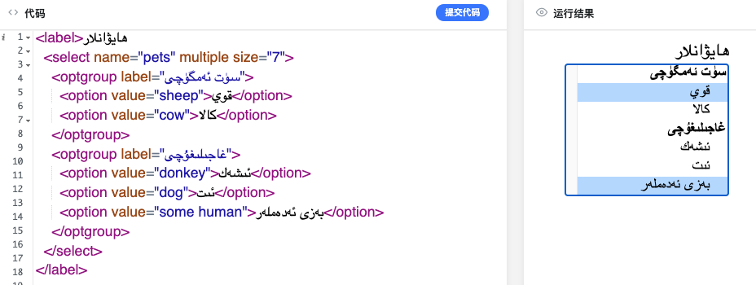
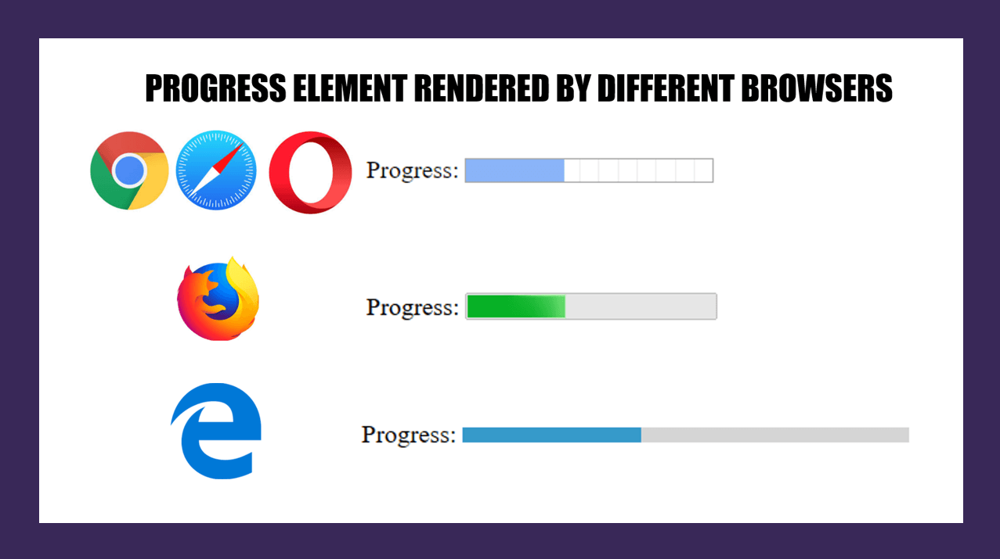

# يىپەك يولىدىكى HTML ساداسى | 7-قىسىم

## تولدۇرما جەدۋىلى - II


تولدۇرما دىگەن سۆز form سۆزىدىن ئۆزلەشتۈرۈلگەن بولۇپ، تور بەت زىيارەت قىلغۇچىنىڭ ھەرخىل ئۇچۇرلارنى تولدۇرۇش ئارقىلىق تور بەت بىلەن ئالاقە قىلىدىغان ئۇسۇللىرىدىن بىرى ھېسابلىنىدۇ.  ئالدىنقى بۆلەكتە بىز تولدۇرمېغا مۇناسىۋەتلىك `form`  ۋە `input` قاتارلىق ئېلمىنىتلار بىلەن تونۇشۇپ چىققان ئىدۇق. بۇ بۆلەكتە بىز داۋاملىق تولدۇرمېغا مۇناسىۋەتلىك خەتكۈچلەر ۋە ئۇلارنىڭ مۇھىم خاسلىقلىرى ئۈستىدە توختىلىپ ئۆتىمىز.


1. `<button>` خەتكۈچى

بۇ خەتكۈچ ئادەتتە بىر كۇنۇپكىنى ئىپادىلەيدىغان بولۇپ، سۈكۈتتىكى ھالىتىدە ھېچقانداق ئىپادىسى بولمايدۇ، شۇڭا بىز بۇ خەتكۈچنىڭ ھەرخىل خاسلىقلىرىدىن پايدىلىنىپ شۇ كۇنۇپكىنىڭ ئىپادىسىگە ئېنىقلىما بىرىمىز. 

- `type` خاسلىقى - بۇ خاسلىق `button` نىڭ ئەڭ مۇھىم خاسلىقلىرىدىن بىرى بولۇپ، `submit` ، `reset` ۋە `button` دىگەن قىممەتلەرنى بىلدۈرىدۇ. بۇ قىممەتلەر كۇنۇپكا ئېلېمېنتىغا ئوخشىمىغان ئىقتىدار ياكى ئىپادىلەرنى بېرەلەيدۇ. تەپسىلاتى ئالدىنقى ساندىكى `<input>`  نىڭكىگە ئوخشاش.
- `autofocus` خاسلىقى - ئاپتوماتىك فوكۇسلىنىش. بول قىممىتى قوبۇل قىلىدۇ شۇنداقلا پۈتۈن توربەت يۈزىدە بىرلا ئىلىمىنتقا ئاپتوماتىك فوكۇسلىنىشنى بەلگىلەپ بەرگىلى بولىدۇ.
- `disabled` خاسلىقى - بول قىممىتى قوبۇل قىلىدىغان بولۇپ، `true` ھالىتىدە كۇنۇپكىنىڭ «چىرايى ئۆڭۈپ» چېكىلمەس ھالەتكە كىرىدۇ.
- `name` خاسلىقى - كۇنۇپكىنىڭ نامى. كۇنۇپكىنىڭ `value` خاسلىقى بىلەن `نامى=قىممىتى` دىگەن شەكىلدە مۇلازىمىتېرغا ئۇچۇر يوللاش ئۈچۈن ئىشلىتىلىدۇ.

`button` ئېلېمېنتىنىڭ يەنە `form` غا ئوخشاش خاسلىقلىرى بولۇپ، ئەگەر ئۇلارغا قىممەت بېرىلگەندە، شۇ قىممەتلەر ئاتا تولدۇرمېنىڭ مۇناسىۋەتلىك خاسلىقلىرىنى ئىناۋەتسىز قىلىۋېتىدۇ. بۇ خاسلىقلار بولسا :

```
formaction, formmethod, formenctype, formvalidate, formtarget 
```

2. `<select>` خەتكۈچى

بۇ خەتكۈچ بىر ئاسما تىزىملىك ھاسىللايدىغان بولۇپ، ئادەتتە `<option>` خەتكۈچى بىلەن ئاتا-بالا ئېلمىنىتلار ھالىتىدە ئىشلىتىلىدۇ.

```html
<select id="pet-select" name="pet-select">
 <option value="">-- Tallag --</option>
 <option value="dog">It</option>
 <option value="cat">Mvshvk</option>
 <option value="others">Bashqa</option>
</select>
```

يۇقىرقى كود بۆلىكىدە كۆرگىنىمىزدەك، `select` نىڭ ئىچىدە بىز ھەر بىر ئەزانى ئايرىم `option` خەتكۈچى بىلەن ئوراپ پۈتۈن بىر ئاسما تىزىملىكنى شەكىللەندۈرەلەيمىز. سۈكۈتتىكى تاللانغان ئەزا بىرىنچى ئەزا بولىدىغان بولۇپ، `option` نىڭ `selected` خاسلىقى ئارقىلىق بىز خالىغان ئەزانى سۈكۈتتىكى تاللانغان ئەزاغا ئايلاندۇرالايمىز. 

`select` ئېلېمېنتىنىڭ تەكىتلەشكە تېگىشلىك خاسلىقلىرىدىن `multiple` ۋە `size`  بار بولۇپ، بۇلاردىن پايدىلىنىپ بىز كۆپ تاللاشنى ۋە كۆپ تاللىنىش ھالىتىدىكى ئاسما تىزىملىكنىڭ بىر قېتىمدا كۆرۈنۈپ تۇرىدىغان ئەزا سانىنى بەلگىلەپ بېرەلەيمىز.

ئەلۋەتتە يەنە، ئاسما تىزىملىكنىڭ ئەزالىرىنى تۈرلەرگە بۆلۈپ كۆپ تاللاشنى ئەمەلگە ئاشۇرغىلىمۇ بولىدۇ. `optgroup` ۋە `option` ئېلېمېنتلىرىنى بىرىكتۈرۈپ ئىشلىتىش ئارقىلىق بىز تۆۋەندىكىدەك ئۈنۈمگە ئېرىشەلەيمىز.




3. `<textarea>` خەتكۈچى

بۇ خەتكۈچ بىر تېكىست بۆلىكى كىرگۈزۈش رامكىسىنى ھاسىللايدىغان بولۇپ، قۇر ئاتلاشنى قوللايدىغان ئارتۇقچىلىقى بار. بۇ ئىلىمىنتنىڭ كۆپىنچە خاسلىقلىرى  `<input>` ئېلېمېنتىغا ئوخشاش بولۇپ، `maxlength` ۋە `minlength` بىلەن كىرگۈزۈلگەن ھەرپ سانىنى چەكلىگىلى، ۋە `row` خاسلىقى بىلەن رامكا ئېگىزلىكىنى بەلگۈلىگىلى بولىدۇ. ئۇندىن باشقا مۇھىم بولغان `wrap` دىگەن خاسلىقى بار بولۇپ، تېكىستتنىڭ ئاپتوماتىك قۇر ئاتلاش ئىپادىلىرىنى خاسلاشتۇرۇپ تەڭشىگىلى بولىدۇ.

4. `<progress>` خەتكۈچى

ئىسمىدىن چىقىپ تۇرغىنىدەك، بۇ ئىلىمىنت توركۆرگۈچلەردە بىر «جەريان كۆرسەتكۈچ» نى ھاسىللايدىغان بولۇپ، ھازىر كۆپىنچە زامانىۋى تور كۆرگۈچلەر بۇ خەتكۈچنى قوللايدۇ. بۇ ئىلىمىنتنى ئىشلىتىشمۇ ناھايىتى ئاددىي بولۇپ، `max` خاسلىقى بىلەن پۈتۈن جەرياننىڭ قىممىتىنى، `value` خاسلىقى بىلەن ھازىرقى قىممىتىنى بەلگىلەپ بەرسەكلا بولىدۇ.

```html
<progress id="file" max="100" value="70"> 70% </progress>
```

سەل ئەپسۇسلۇنارلىق يىرى شۇكى، بۇ ئىلىمىنت ھەرخىل تور كۆرگۈچلەردە ئوخشىمىغان شەكىلدە ۋە رەڭدە كۆرسىتىلىشى مۇمكىن، شۇڭا ئوخشىمىغان تور كۆرگۈچلەردە لايىھە بىلەن بىردەكلىكنى ساقلاش ئۈچۈن ئەڭ ياخشىسى CSS بىلەن بىر قۇر پەردازلىۋىتىپ ئىشلىتىشىمىزگە توغرا كىلىدۇ.



(بەلكىم ۋاقىتنىڭ ئۆزگىرىشىگە ئەگىشىپ تور كۆرگۈچلەرنىڭ ئىپادىسىدىمۇ ئۆزگۈرۈش بولىشى مۇمكىن)


تولدۇرمېغا مۇناسىۋەتلىك مەزمۇنلار شۇنىڭ بىلەن ئاخىرلاشتى. كېلەركى ساندا بىز HTML باش بۆلىكى بىلەن تونۇشۇپ چىقىمىز.

 كۆرۈشكىچە ئامان بولغايسىلەر. 👋


> كىيىنكى سانلاردىن ئالدىن مەلۇمات:
>
> * head بۆلىكى (HTML باش بۆلىكى)

---

يازمىدا: ئارسايبەگ

