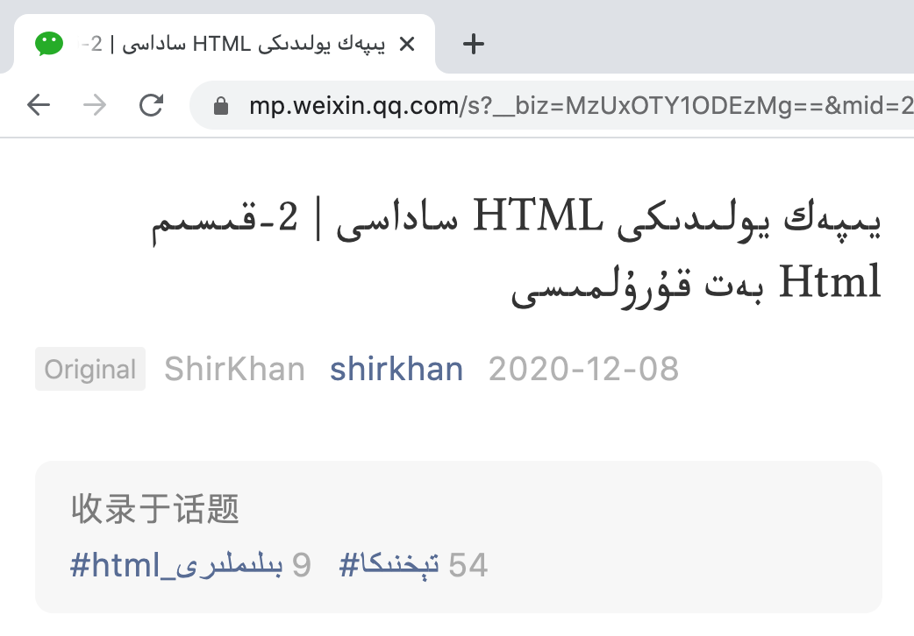

# يىپەك يولىدىكى HTML ساداسى | 9-قىسىم

## head بۆلىكى


سالام ئوقۇرمەن! بىز قوللانمىمىزنىڭ دەسلەپكى باسقۇچلىرىدا HTML بەت قۇرۇلمىسىنى تونۇشتۇرۇپ،  `head` ۋە `body` خەتكۈچلىرى, يىلتىز-خەتكۈچ بولغان `html` خەتكۈچىنىڭ بىۋاستە بالا خەتكۈچى بولۇپ بىر بەتتنى تەشكىللەيدىغانلىقىنى تەكىتلىگەن ئىدۇق. ۋە شۇنداقلا، توربەت يۈزىدە بىۋاستە كۆرسىتىلىدىغان مەزمۇن `body` ئىلىمىنتنىڭ ئىچىگە جايلاشقان ئىلىمىنتلار بولىدىغانلىقى ئۈچۈن، ئوقۇرمەنلەرگە ئەمەلىي مەشغۇلاتچانلىقى تېخىمۇ كۈچلۈكرەك بولۇشۇنى كۆزدە تۇتۇپ، `head` ئىلىمىنتىغا مۇناسىۋەتلىك مەزمۇنلاردىن ۋاقتىنچە ئاتلاپ ئۆتۈپ كەتكەن ئىدۇق. ئالدىنقى بىر نەچچە قىسىملاردا `body` ئىلىمىنتىنىڭ ئىچىگە ئورۇنلاشقان ئىلىمىنتلارنى بىر قۇر تونۇشتۇرۇپ بولغانلىقىمىز ئۈچۈن، بۈگۈن بەت قۇرۇلمىسىدىكى يەنە بىر مۇھىم بولغان ئەزا `head` ئىلىمىنتىنى چۈشۈنۈشىمىز تېخىمۇ ئاسانغا توختشىغا ئىشەنچىم كامىل.

```html
<!DOCTYPE html>
<html>
    <head></head>
    <body></body>
</html>
```

HTML بەت قۇرۇلمىسىغا مۇناسىۋەتلىك مەزمۇنلارنى ئەسكە ئالالمىغان بولسىڭىز قوللانمىمىزنىڭ ئىككىنجى قىسىمىغا قاراڭ.


1. head بۆلىكىنىڭ رولى ۋە مۇھىم ئەزا ئىلىمىنتلار

ئادەتتە `<head>` ئېلېمېنتىنىڭ نىڭ ئىچىدە، بىز تور بەتنى قۇرۇپ چىقىشتا زۆرۈر بولغان ئىلىمىنتلارنى ئورۇنلاشتۇرىمىز. مەسىلەن، بەت ماۋزۇسى، مېتا سانلىق مەلۇماتلار، ئىچكى ياكى تاشقى CSS ۋە JavaScript كودى ۋە ئۇلانمىلىرى دېگەندەك. بۇ مەزمۇنلارنىڭ كۆپىنچىسى بەت يۈزىدە بىۋاسىتە كۆرۈنمەي، پەقەت تور كۆرگۈچلەرنىڭ مۇشۇ توربەتنى توغرا كۆرسىتىپ بېرىشىگە ياردەم بېرىدۇ. ئەگەر سىزنىڭ HTML كودىڭىزدا `head` ئىلىمىنتى بولمىغان تەقتىردە، تور كۆرگۈچ ئاپتوماتىك ھالدا `head` ئىلىمىنتىدىن بىرنى قۇرۇپ بىرىدۇ.

`head` ئىلىمىنتىنىڭ ئۆزىگە خاس ئالاھىدە خاسلىقلىرى بولۇپ، ئاساسلىقى بەت ئۇچۇرلىرىنى ئىپادىلەيدىغان ئىلىمىنتلارغا «قاپلىما» لىق رولىنى ئۆتەيدۇ خالاس. بۇ قاپلىما بۆلەك ئادەتتە تۆۋەندىكىدەك ئەزا ئىلىمنتلاردىن تەركىپ تىپىشى مۇمكىن.

:golf: `meta`  خەتكۈچى

 بۇ خەتكۈچ ئادەتتە ئۈشبۇ توربەتنىڭ مېتا ئۇچۇرلىرىنى ئۆزئىچىگە ئالىدۇ.

 بۇ يەردىكى مېتا سانلىق مەلۇمات دىگەن سۆز ئىنگىلىزچە metadata دىن ئىلىنغان بولۇپ، زاغرا تىلىمىزدا، سانلىق مەلۇماتلارنى تەسۋىرلىگۈچى ئۇچۇر دەپ چۈشەنسەك بولىدۇ. مەسىلەن، تور بەتنىڭ ئۆزى ئەمەلىيەتتە سانلىق مەلۇمات، مانا مۇشۇ توربەتنىڭ ئاپتورى ۋە مەزمۇنغا ئىشلىتىلگەن تىلى دىگەندەك ئۇچۇرلارنى بىز مېتا سانلىق مەلۇماتلار دىسەك بولىدۇ.

:golf: `title`  خەتكۈچى

بۇ خەتكۈچ مۇشۇ توربەتنىڭ ماۋزۇسىنى ئىپادىلەيدۇ. دىققەت قىلىشقا تىگىشلىك يىرى شۇكى، بۇ ماۋزۇ بەت يۈزىدە كۆرۈنمەستىن بەلكى تۆر كۆرگۈچ كۆزنىكىنىڭ ماۋزۇسى ھالىتىدە كۆرسىتىلىدۇ.



:golf: `base`  خەتكۈچى

بۇ خەتكۈچ پۈتۈن بەت يۈزىدىكى نىسپىي ئۇلانمىلىرىنىڭ مۇتلەق ئادرىسىنى ھىساپلاشتىكى باشلىنىش نۇقتىسى بولۇپ، سۈكۈتتىكى قىممىتى دەل زىيارەت قىلىنىۋاتقان بەتنىڭ ئۇلانمىسى بولىدۇ. 

مۇتلەق ۋە نىسپىي ئۇلانمىلار، ۋە `base` خەتكۈچكە مۇناسىۋەتلىك تېخىمۇ تەپسىلىي مەزمۇنلار قوللانمىمىزنىڭ 6-قىسىمىدا تەپسىلىي چۈشەندۈرۈلگەن. 

:golf: `link`  خەتكۈچى

بۇ ئىلىمىنتنىڭ رولى، ئۆزى تۇرۇشلۇق توربەت بىلەن سىرتقى مەنبەلەرنىڭ ئۇلانما مۇناسىۋىتىگە ئىنىقلىما بىرىش بولۇپ، كۆپىنچە ھاللاردا سىرتقى پاسونلارنى ئۆزى تۇرۇشلۇق بەتكە «ئۇلاش» ئۈچۈن ئىشلىتىلىدۇ.

```html
<link href="example.css" rel="stylesheet">
```

مەسىلەن، يۇقارقى `example.css` دىگەن پاسون ھۆججىتىنىڭ بۇ بەت بىلەن بولغان مۇناسىۋىتى دەل `rel` خاسلىقى (relationship) تەسۋىرلىگەن پاسون (يەنى stylesheet) دۇر.  پاسونلارنى بەت يۈزىگە قىستۇرۇش ئۇسۇللىرى توغرىسىدا بۇ يازمىنىڭ ئاخىرقى بۆلىكىدە تەپسىلىي توختۇلىمىز.

:golf: `script`  خەتكۈچى

بۇ خەتكۈچ ئىسمىدىن چىقىپ تۇرغىنىدەك، تور بەتكە «قوليازما» تىلىنى قىستۇرۇش ئۈچۈن ئىشلىتىلىدۇ. يەنىمۇ ئىنىقراق قىلىپ ئىيتقاندا، توربەتلەرگە JavaScript كودى قىستۇرۇپ ئىجرا قىلدۇرۇش ئۈچۈن ئىشلىتىلىدۇ.

:golf: `noscript`  خەتكۈچى

بۇ خەتكۈچ قوليازما تىللىرىنى قوللىمايدىغان ياكى قوليازما تىللىرىنىڭ ئىجرا بولۇشىنى توسۇۋەتكەن تور كۆرگۈچلەردە مەلۇم مەزمۇننى كۆرسىتىش ئۈچۈن ئىشلىتىلىدىغان بولۇپ، كۆپىنچە يۇقىرىدىكى `script` خەتكۈچى بىلەن بىللە ئىشلىتىلىدۇ.

```html
<script>
	console.log('بۇ كود قوليازما تىللىرىنى قوللايدىغان تور كۆرگۈچلەردە ئىجرا بولىدۇ')
</script>

<noscript>
  بۇ تېكىست قوليازما تىللىرىنى قوللىمايدىغان تور كۆرگۈچلەردە كۆرسىتىلىدۇ
</noscript>
```


:golf: `style`  خەتكۈچى

بۇ خەتكۈچ تور بەتلەرگە ئىچكى پاسون يېزىش ئۈچۈن ئىشلىتىلىدۇ. ئىچكى ۋە تاشقى پاسونلار (يەنى CSS) توغرىسىدا، يازمىنىڭ ئاخىرىدا قىسقىچە تونۇشتۇرۇپ ئۆتىمىز.

:golf: `template`  خەتكۈچى

بۇ «قېلىپ» خەتكۈچى بولۇپ، ئادەتتە توربەتتە بىۋاستە كۆرسىتىلمەستىن، بەلكى JavaScript كودى ئارقىلىق ئەمەلىيلەشتۈرۈلۈپ (instantiate) كۆرسىتىلىدۇ.


2. `meta` ئىلىمىنتىغا نەزەر

بىز يۇقىرىدا، `meta` ئىلىمىنتىنىڭ توربەت مېتا سانلىق مەمۇماتلىرىغا ئىنىقلىما بىرىدىغانلىقىنى تىلغا ئىلىپ ئۆتكەن ئىدۇق. تۆۋەندە بىز بۇ ئىلىمىنت بىلەن يەنىمۇ تەپسىلىيرەك تونۇشۇپ چىقىمىز.

ھەربىر `meta` خەتكۈچى توربەتنىڭ بىر تۈرلۈك مېتا ئۇچۇرىنى ئىپادىلەيدىغان بولۇپ، بىز كۆپلىگەن `meta` خەتكۈچلىرىنى يېزىش ئارقىلىق بىر بەتنى تەسۋىرلىسەك بولىدۇ. 

:golf: `charset` خاسلىقى 

بۇ خاسلىق توربەتنىڭ ھەرپ-بەلگە ئىنكودلاش سېستىمىسىغا ئىنىقلىما بىرىدىغان بولۇپ، كۆپىنچە `utf-8` قىممىتى تەۋسىيە قىلىنىدۇ. بۇ خاسلىقنى بىز كۆپىنچە بەتلەردىكى `meta` خەتكۈچىگە بىرەلەيمىز.

```html
<meta charset="utf-8">
```


:golf: `name` ۋە `content` خاسلىقى

بۇ ئىككى خاسلىق بىر `meta` خەتكۈچىگە بىرىلىدىغان بولۇپ، بىر مېتا سانلىق مەلۇماتنىڭ «نامى» ۋە «مەزمۇنى» دىگەن شەكىلدە كىلىدۇ. شۇڭا بۇ ئىككى خاسلىق بىلەن بىز خالىغان  ئۇچۇرلارنى ئىپادىلەپ توربەتنى تەسۋىرلىيەلەيمىز. مەسىلەن: توربەت مەزمۇنىنىڭ ئاپتورى، مەزمۇن خەتكۈچلىرى، ھالقىلىق سۆزلەر، كۆرۈنمە يۈزى ئۇچۇرلىرى ... دىگەندەك.

```html
<meta name="description" content="HTML Sadasi">
<meta name="keywords" content="HTML, derslik, material">
<meta name="author" content="arsaybeg">
<meta name="viewport" content="width=device-width, initial-scale=1">
<meta name="subject" content="your document's subject">
```


:golf: `http-equiv` ۋە `content` خاسلىقلىرى

بۇلار ھەم بىر جۈپ خاسلىقلار بولۇپ، HTTP ئىلتىماسىنىڭ جاۋابىدىكى باش ئۇچۇرلىرىنى ئۆزگەرتىش ئۈچۈن ئىشلىتىلىدۇ. بۇ يەردىكى `http-equiv` بولسا HTTP باش ئۇچۇرىدىكى خاسلىق نامىنى، `content` بولسا ئۆزگەرتمەكچى بولغان خاسلىقنىڭ قىممىتىنى ئىپادىلەيدۇ. بۇ مەزمۇنلارنى تېخىمۇ تەپسىلىي چۈشۈنۈشكە ئوقۇرمەنلەردىن HTTP كېلىشىمىسىگە بولغان دەسلەپكى چۈشەنچە تەلەپ قىلىنىدىغان بولغاچقا، بۇ يازمىمىزدا بۇ ئىككى خاسلىق ئۈستىدە تەپسىلىي توختالمايمىز. 


:question: ئەمدى ئويلاپ باقايلى: ئەگەر مېتا سانلىق مەلۇماتلار توربەت يۈزىدە كۆرسىتىلمىسە، بىز نىمىشقا ئۇلارنى يەنە HTML كودىغا قىستۇرۇپ قويىمىز ؟

گەرچە `meta` ئىلىمىنتلار ھەتتاكى پۈتۈن `head` ئىلىمىنتىنىڭ ئىچىدىكى مەزمۇنلار توربەت يۈزىدە بىۋاستە زىيارەت قىلغۇچىلارغا كۆرسىتىپ بىرىلمىسىمۇ، تور كۆرگۈچلەرنىڭ بەت يۈزىدىكى مەزمۇنلارنى ھاسىللىشىغا ۋە ئىزدەش ماتورلىرىنىڭ مەزمۇنلارنى مۇندەرىجىلىشىگە زور ياردىمى بولىدۇ. بۇ مەزمۇنلارغا قىزىقىدىغان ئوقۇرمەنلەرنىڭ «تور كۆرگۈچ HTML كودىنى قانداق ھاسىللايدۇ»، «ئىزدەش ماتورىنىڭ خىزمەت پىرنسىپى» ۋە «ئىزدەش ماتورىغا قارىتا ئەلالاشتۇرۇش» دىگەن تىمىلار ئۈستىدە ئىزدىنىپ بىقىشىنى ۋە سالونغا ئىنكاس قالدۇرىشىنى سورايمىز.

مۇشۇ يەرگە كەلگەندە، قوللانمىمىزنىڭ HTML ھەققىدە دەسلەپكى چۈشەنچە ھاسىل قىلىش ۋەزىپىسى تامام بولدى دەپ ئويلۇدۇم. ئەلۋەتتە ھازىرغىچە چۈشەندۈرۈلگەن مەزمۇنلار ئاساسىدا، بىر تور بەت يېزىپ چىقىش تامامەن مۇمكىن. لىكىن ئىشىنىمەنكى، بۇ يېزىپ چىققان بېتىڭىزنىڭ كۆرۈمى ۋە ئىقتىدارى ناھايىتى چەكلىك بولۇپ قالىدۇ. شۇنىڭ ئۈچۈن بىز توربەتلەرنى يېزىشتا بىز HTML دىن باشقا يەنە CSS ۋە JavaScript قاتارلىق تېخنىكىلارغا تايىنىمىز. ئەلۋەتتە، بۇ ئىككى مەزمۇن ئۈشبۇ قوللانمىمىزغا تەۋە ئەمەس، لىكىن، CSS پاسونى ۋە JavaScript كودلىرىنى HTML يۈزىگە قانداق قىستۇرۇش ۋە ئىجرا قىلىش، ئەلۋەتتە قوللانمىمىزنىڭ مەزمۇنلىرىغا تەۋە.


3. تور بەت يۈزىگە پاسون قىستۇرۇش

تور بەت يۈزىدىكى پاسون دىگىنىمىز CSS نى كۆرسىتىدىغان بولۇپ، ئاساسلىقى توربەتتىكى ئىلىمىنتلارنىڭ قانداق كۆرسىتىلىشىگە ئىنىقلىما بىرىدۇ. بىز بۇ قوللانمىدا پاسونلار ئۈستىدە توختالمايمىز، لىكىن چۈشۈنۈش ئاسان بولسۇن، تۆۋەندىكى كودنىڭ بىر بۆلەك CSS كودى ئىكەنلىكىنى ۋە ئىلىمىنتلارنىڭ خەت رەڭگىنى قىزىل رەڭدە كۆرسىتىپ بىرىدىغان رولى بارلىقىنى بىلىۋاساقلا بولدى.

```css
{
	color: red; 
}
```

HTML خەتكۈچلىرى ئارقىلىق تور بەتكە پاسون قىستۇرۇشنىڭ ئۈچ خىل ئۇسۇلى بار:

:golf: ئېلىمىنتكە باغلانغان پاسون

بىز قوللانمىمىزنىڭ بۇرۇنقى قىسىملىرىدا تىلغا ئىلىپ ئۆتۈپ كەتكەن ئىلىمىنتلارنىڭ `style` خاسلىقى دەل مۇشۇ خىل ئۇسۇلنى ئىشلىتىپ بىر ئىلىمىنتقا پاسون بىرەلەيدۇ، ھەمدە بۇ پاسون پەقەت مۇشۇ ئىلىمنتقىلا باغلانغان بولىدۇ.

```html
<div style="color: red"> Bu bir qur xet kizil körvnidu. </div>
```

 :golf: بەت ئىچى پاسونى

بۇ `head` بۆلىكىگە جايلاشقان `style` خەتكۈچىنىڭ ئىچىگە يېزىلىدىغان CSS كودىنى كۆرسىتىدىغان بولۇپ، بىز بۇ خەتكۈچ ئارقىلىق مۇشۇ بەتكە مۇناسىۋەتلىك بارلىق پاسونلارغا ئىنىقلىما بىرەلەيمىز. تەكىتلەشكە تىگىشلىك يىرى شۇكى، `style` خەتكۈچى بىلەن `style` خاسلىقى بىر ئۇقۇم ئەمەس.

```html
<head>
    <style>
      body {
          background: red;
      }
    </style>
</head>
```

:golf: تاشقى پاسون (ئۇلانما پاسون)

بۇ ئۇسۇل دەل بىز تېمىمىزنىڭ دەسلەپكى بۆلىكىدە سۆزلەپ ئۆتۈپ كەتكەن `link` خەتكۈچى ئارقىلىق توربەتكە پاسون يۈكلەيدىغان بولۇپ، CSS كودىنى HTML كودىدىن پۈتۈنلەي ئايرىپ چىقىرىپ، كودلارنى تېخىمۇ تەرتىپلىك باشقۇرۇشىمىزغا پايدىسى بار. بۇ ئۇسۇل ئارقىلىق بىز CSS كودىنى ئايرىم بىر ھۆججەتكە يېزىپ ساقلىۋالغاندىن كىيىن، `link` ئىلمىنتىنىڭ `href` خاسلىقىغا CSS ھۆججىتىنىڭ ئۇلانمىسىنى بەرسەكلا بولىدۇ.

```html
<head>
    <link rel="stylesheet" type="text/css" href="pason.css">
</head>
```

 يۇقارقى `rel` مۇشۇ بەت بىلەن تاشقى ئۇلانغان CSS ھۆججىتىنىڭ مۇناسىۋىتىگە ئىنىقلىما بىرىدۇ، `type` بولسا ئۇلانغان ھۆججەتنىڭ ھۆججەت تىپىغا ئىنىقلىما بىرىدۇ.


4. تور بەت يۈزىدە JavaScript ئىجرا قىلىش


> كىيىنكى ~~سانلاردىن~~ ساندىن ئالدىن مەلۇمات:
>
> * مەخپىي

---

يازمىدا: ئارسايبەگ

